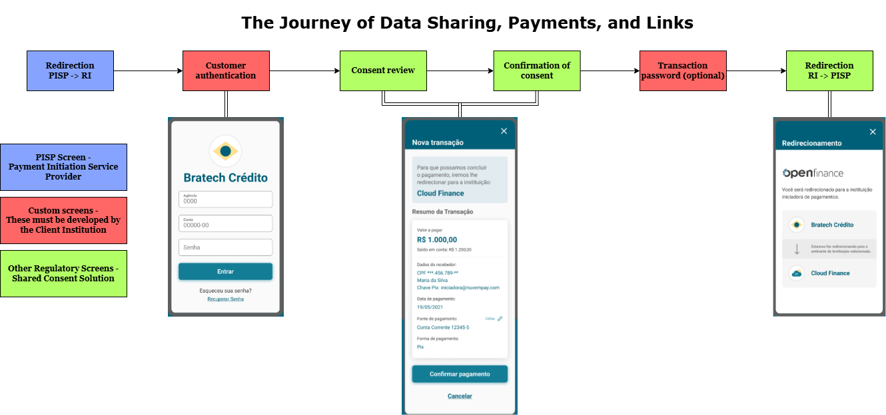

## Shared Consent

The **shared consent** solution in the context of Open Finance refers to a centralized solution allowing financial institutions to manage user consents for data sharing, payments, and account linkages among different ecosystem participants in an integrated manner. It simplifies the process by centralizing the stages of consent display, confirmation, and cancellation, ensuring regulatory compliance and enhancing user experience while different parts of the system maintain their specific responsibilities throughout the consent lifecycle.

Our solution was developed to facilitate adherence to Open Finance Brazil, efficiently meeting regulatory requirements. Here, you will find guides that explain, in simple terms, the benefits of using our solution and what needs to be developed by your team.

---

## Benefits of Using Our Solution

1. **Ease of Implementation:**
   Our solution meets all regulatory requirements, saving your development team time and effort. With the main processes for consent display, confirmation, and management already implemented, everything is ready for immediate use.

2. **Regulatory Compliance:**
   We are in full compliance with Open Finance Brazil guidelines, ensuring you adopt best practices for consent management.

3. **User Experience:**
   We offer an intuitive interface that allows clients to view and manage their consents directly on the platform, facilitating navigation and ensuring compliance with regulatory requirements.
