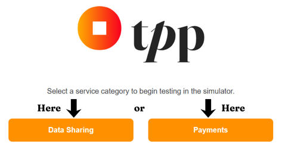
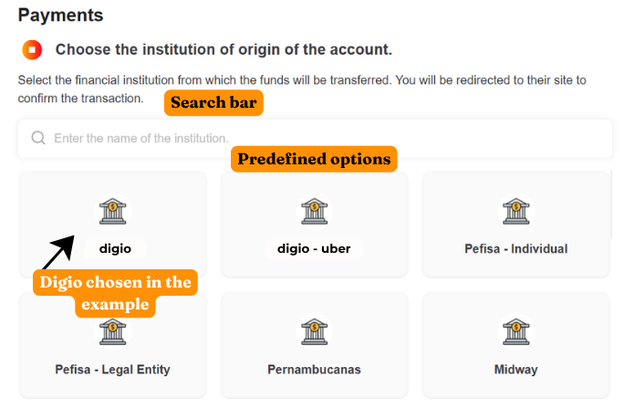
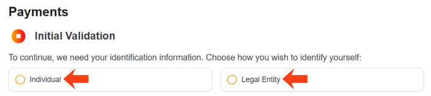
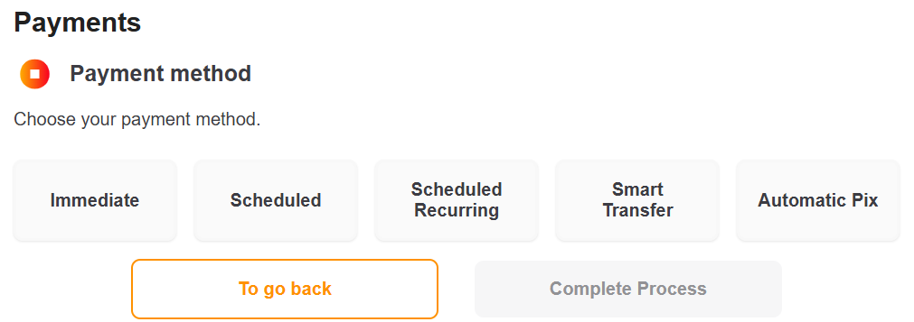
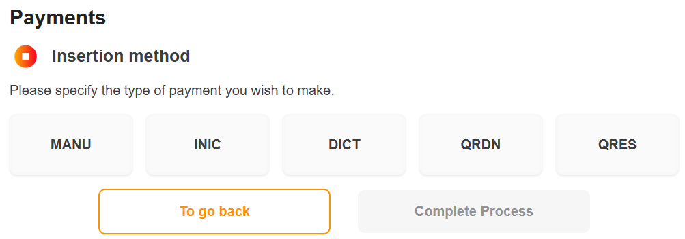
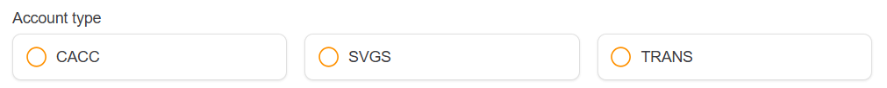
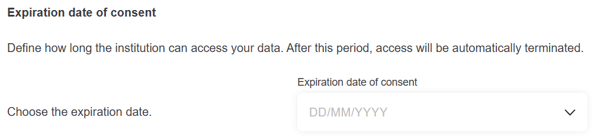
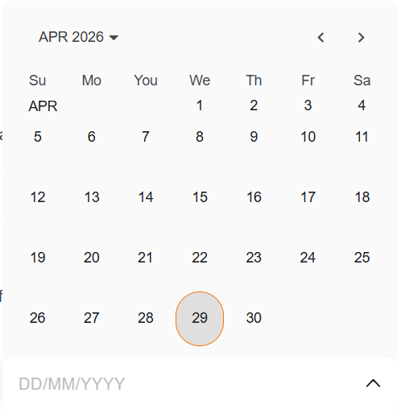

## Introduction

This guide provides explanations about the **OpusTPP** tool and detailed instructions for:

- ✔ Navigating through the tool’s intuitive interface;
- ✔ Filling in required fields accurately;
- ✔ Validating transactions securely;
- ✔ Solving common errors.

By following the instructions presented, you will be able to take advantage of all **OpusTPP** features in a simple and efficient way.

## What is OpusTPP?

Opus TPP is an advanced platform developed to simplify the **simulation** and **execution** of operations within the Open Finance ecosystem, including:

- Instant payments:
  - Immediate;
  - Scheduled;
  - Recurring scheduled;
  - Smart transfers;
  - Automatic Pix.
- Data sharing (financial information consent).

## Terms and Definitions

Before starting the instructions for use, here is an explanation of technical or specific terms used on the website:

- **DICT:** PIX Charge Initiation Document (BACEN standard).
- **QRDN/QRES:** Dynamic QR Code (QRDN) or Static QR Code (QRES) for PIX payments.
- **INIC:** Payment initiation through specific codes.
- **Consent:** Formal authorization for data sharing between institutions.

## Instructions

The first step is to select which service category you want to test. Choose between **Payments** and **Data Sharing**.

### **Payments**

#### 1. Source account

At this stage, you must select the financial institution from which the amount will be transferred. You can choose a predefined institution displayed on the screen or search for the institution you want using the search bar located at the top of the page:

>**EXAMPLE:**
>Type "Digio" to filter.

#### 2. Initial validation

Here you must choose how you will be identified:

- Individual;
- Legal Entity.

If you choose Individual, you must provide the payer’s CPF. If you choose Legal Entity, you must also provide the CNPJ.
After correctly filling in the required fields, you may proceed to the next step.

#### 3. Payment method

Here, select the payment method to be performed. The options are:

- Immediate;
- Scheduled;
- Recurring scheduled;
- Smart transfer;
- Automatic Pix.

| Method | Additional Fields |
| :----: | :---------------: |
| **Recurring Scheduled** | End date and repetition interval |
| **Smart Transfer** | Frequency (daily/weekly/monthly/yearly), validity period (hours/days) |
| **Automatic Pix** | Frequency (weekly/monthly/quarterly/semiannual/yearly), validity period |

>**NOTE:**
>Dynamic fields will be displayed according to the selected method.

#### 4. Input method

Here you must choose between the five available options for how the payment recipient’s data will be entered, for Individuals or Legal Entities.

Fill in the editable fields for each method (all five) and select the recipient account type near the end of the page:

- **INIC and DICT:** After filling in the information, enter the recipient’s Pix key.
- **QRDN:** After filling in the information, enter the recipient’s Pix key and the Dynamic QR Code.
- **QRES:** After filling in the information, enter the recipient’s Pix key and the Static QR Code.

#### 5. Redirect to the bank

Wait for the redirection to confirm the operation. Once you receive confirmation from the issuing bank, the process is complete!

>**AVERAGE TIME:**
>Approximately 5–15 seconds for Pix.

### **Data Sharing**

#### 1. Source account - Data Sharing

At this stage, you must select the financial institution from which the amount will be transferred. You can choose a predefined institution displayed on the screen or search for the institution you want using the search bar located at the top of the page:

>**EXAMPLE:**
>Type "Digio" to filter.

#### 2. Initial validation - Data Sharing

Here you must choose how you will be identified:

- Individual;
- Legal Entity.

If you choose Individual, you must provide the payer’s CPF. If you choose Legal Entity, you must also provide the CNPJ.
After correctly filling in the required fields, you may proceed to the next step.

#### 3. Data selection

At this stage, by default, all options will be **selected**, meaning all listed data will be shared.

The consent data types available on the page are:

- **Registration data;**
- **Credit card;**
- **Accounts;**
- **Loans;**
- **Financing;**
- **Overdrafts;**
- **Discounted receivables;**
- **Bank fixed income;**
- **Credit fixed income;**
- **Variable income;**
- **Government bonds;**
- **Investment funds;**
- **Exchange;**
- **Resources.**

At the end of the list, it is possible to define the validity period for the selected data consent. This period defines how long your data may be accessed by the institution. The validity period is defined using a selection box, as shown in the image:

When clicking the selection box, a calendar will open:

After choosing the desired period, proceed to the next step.

#### 4. Data review

This is the stage where you can securely review the data that will be shared with your institution. You may view the selected and completed information in a summarized list displayed on your screen.

If you wish to edit any information, simply go back, make the changes, and return to this screen.

If you choose to continue, you will authorize the sharing of the selected and reviewed data through this button:

**And that’s it! The data sharing has been authorized and completed.**
