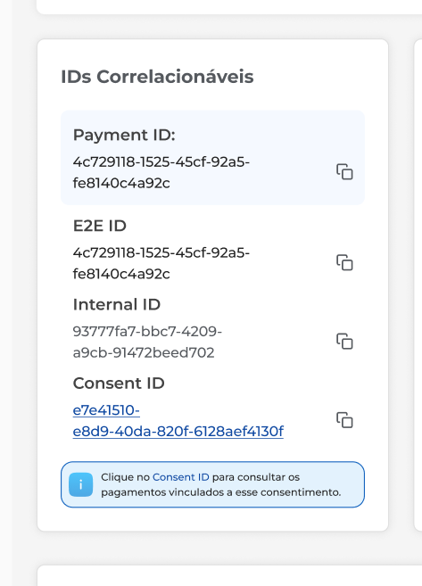
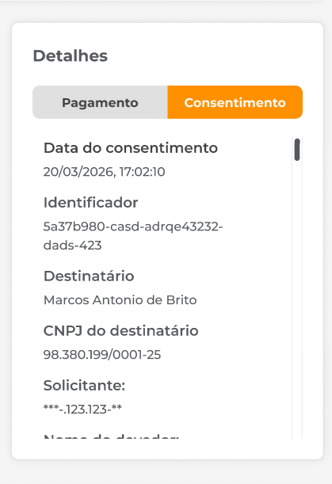
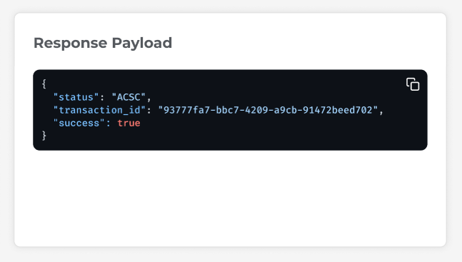

## Introduction

The Backoffice Portal aims to allow the **visualization, consultation, and traceability of payments**, providing detailed information about each transaction, its status, and related data, ensuring complete visibility of the flow from creation to settlement or failure.

This documentation describes the functionalities available on the system screens, as well as the expected behavior of each field and action, assisting in the use and development of the application.

---

## Screen 01 – Login

### **Description - Login**

Initial system screen responsible for user authentication.

### **Fields**

- **Username;**
- **Password.**

### **Rules and Behavior**

- After successful authentication, the user must be automatically redirected to **Screen 02 – Payment Listing**.
- The authentication method is still under definition.
- It is not recommended to use manually defined fixed credentials due to security risks.

---

## Screen 02 – Payment Listing

### Description

Displays all payments registered in the system, allowing search and filtering.

### Listing Fields

- **Payment ID:** Unique payment identifier;
- **E2E ID:** Pix flow identifier;
- **Status:** Current payment status;
- **Holder Institution:** Bank responsible for the payment;
- **Amount:** Monetary value;
- **Created At:** Creation date/time;
- **Settlement Date:** Expected or completed settlement date.

### Possible Statuses

For more detailed information, access [this link](https://openfinancebrasil.atlassian.net/wiki/spaces/OF/pages/1600030369/M+quina+de+Estados+-+v5.0.0-rc.1+-+SV+Pagamentos).

| "Natural" Name              | Code |
| :-------------------------: | :--: |
| Request received            | RCVD |
| Cancelled by user           | CANC |
| Pix ready                   | ACCP |
| Pix sent for settlement     | ACPD |
| Pix rejected                | RJCT |
| Pix settled                 | ACSC |
| Pix pending                 | PDNG |
| Pix scheduled               | SCHD |

### Listing Filters

#### Fixed Fields

- Holder Institution;
- Status.

#### ID Filter

- ID Type:
  - Payment ID;
  - E2E ID;
  - Internal ID;
  - Consent ID;
- Free search field.

#### Date Filter

- Start date (From);
- End date (To).

### Rules

- When applying filters, the button must display an **“X”** to clear the selection.
- No registered payments:

  > “No payments found. Start a new payment to view it.”
- No filter results:

  > “No payments match the selected filters. Adjust the filters and try again.”
- Only the **“Payments”** menu must be available in the sidebar.
- When selecting a payment, the user is redirected to **Screen 03 – Payment Details**.

---

## Screen 03 – Payment Details

### Screen Description

Displays all detailed information about a specific payment.

### Detail Screen Sections

---

### Header

### Fields

- Holder Institution;
- Type: PIX (fixed);
- Amount (with color based on status);
- Status;
- Updated at.

### Actions

- **Back:** Returns to the listing while keeping filters;
- **Refresh:** Retrieves the latest status from the institution.

---

### Correlatable IDs

### ID Fields

- Payment ID;
- E2E ID;
- Internal ID;
- Consent ID.

### Page Actions

- **Copy:** Copies the value to the clipboard;
- **Select Consent ID:** Redirects to the filtered listing.

### Message

> “Click on the Consent ID to view payments linked to this consent.”

---

### Timeline

### Timeline Fields

Each event contains:

- Status (title);
- Date and time;
- FAPI Interaction ID.

### Timeline Rules

- Display only the events informed by the holder institution;
- The number of events may vary.

---

### Details

### Payment

- Created (date/time);
- Updated (date/time);
- Currency.

### Rule

- If there is no update, repeat the creation date.

---

### Consent

### Field Examples (PIX)

- Consent date;
- Identifier;
- Recipient;
- CPF/CNPJ;
- Requester;
- Debtor.

### Field Rules

- The data is for visualization purposes only;
- **Editing any field is not allowed.**

---

### Request Payload

### Request Description

Displays the payload sent by the client institution.

### Request Rule

If unavailable:

> “Request Payload not available for this payment.”

---

### Response Payload

### Response Description

Displays the payload returned by the system.

### Response Rule

If unavailable:

> “Response Payload not available for this payment.”

---

### Error Log

### Error Log Description

Displays the reason for the payment failure.

### Conditional Display

Only for statuses:

- `CANC`;
- `RJCT`.

### Error Log Rule

If unavailable:

> “Error log not available for this payment.”
