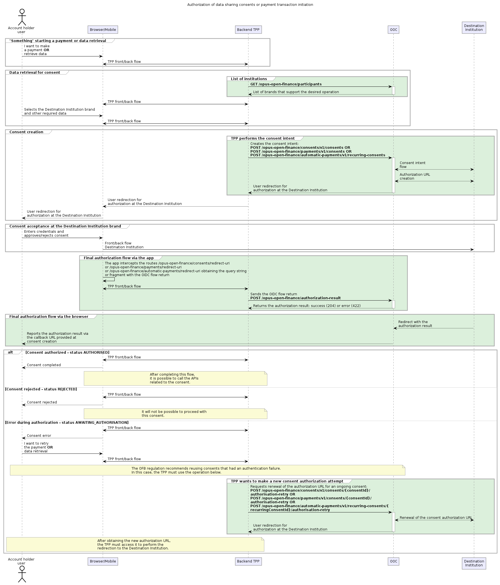
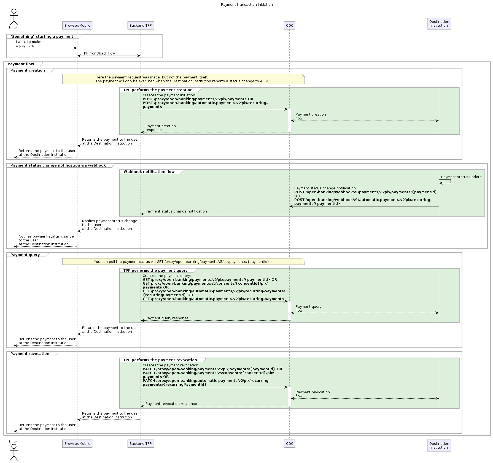
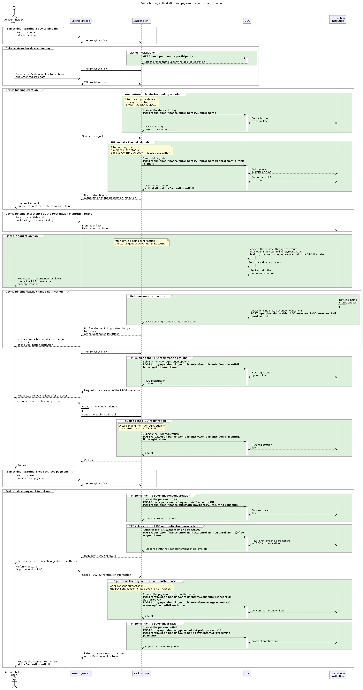

## Operation: Payment Initiation and Data Receipt

This document describes, at a high level, the main business flows supported by the Payment Initiation Module and by the Data Reception Module for integration with the Open Finance Brasil ecosystem. Each flow has a dedicated page with technical details, payloads, and error codes — use the links throughout the text.

## Consent Request Flow

Consent is the authorization granted by the user for a Payment Initiator (ITP) institution to access their data or make payments on their behalf. The request flow is similar for both purposes (data reception and payment initiation), differing only in one specific call.

### Sequence Diagram - Open Finance

### Flow Steps

#### 1. Listing of Participating Institutions

**Endpoint:** `GET /opus-open-finance/participants`

**Purpose:** Identify the institutions available for the consent.

This call returns the list of institution *brands* registered in the Open Finance Brasil Participant Directory that support the desired operations.

Institutions are classified by their roles:

| Type | Description | Purpose |
| ---- | --------- | ---------- |
| **[Data Transmitter](../../../openFinanceBrasil/perfisParticipacao/transmissorDeDados.html)** | Institution that shares information | Allows access to registration and transactional data |
| **[Account Holder](../../../openFinanceBrasil/perfisParticipacao/detentorDeContas.html)** | Institution that holds the user's account | Allows payment initiation operations |

> **Important:** The `AuthorisationServerId` of the selected brand must be used in the `x-authorisation-server-id` header of all subsequent calls.

**Available filters:**

- **role (regulatory role):** DADOS, PAGTO, CONTA, CCORR;
- **familyType (API family):** Defines which resources the institution offers (e.g., "customers-business").

#### 2. Creating the Consent Intent

**Purpose:** Register the ITP's intent to access data or make payments on behalf of the user.

**Endpoints by operation type:**

| Purpose | Endpoint |
| :--------: | :------: |
| Data Reception | `POST /opus-open-finance/consents/v1/consents` |
| Payment Initiation | `POST /opus-open-finance/payments/v1/consents` |
| Automatic Payment Initiation | `POST /opus-open-finance/automatic-payments/v1/recurring-consents` |

**Behavior:**

- The call sends the information about the desired consent to the Destination Institution;
- An `HTTP 201 Created` response indicates successful creation;
- The payload returns the `consentId`, the unique identifier of the consent;
- Initial status: **AWAITING_AUTHORISATION** (awaiting user authorization).

> For details of the payload, see [Data Reception](recepcaoDeDados.html).

#### 3. Redirection for Authorization

After the consent is created, the user must be redirected to the Destination Institution's environment, where they:

- View the information of the requested consent;
- Approve or reject the request;
- Are redirected back to the ITP application at the end of the process.

**Considerations for mobile applications:**

- The application must intercept the redirection URLs;
- After the redirection, it must call the `authorization-result` endpoint with the result of the OIDC flow;
- **It is mandatory** to implement the web redirect route as a contingency, ensuring that the user learns the result even when the URL is opened in another application.

#### 3.1. New Authorization Attempt

In cases of redirection failure (e.g., timeout, server error 500), BACEN recommends **reusing the same consent intent**.

**Endpoints for a new attempt:**

| Purpose | Endpoint |
| :--------: | :------: |
| Data Reception | `POST /opus-open-finance/consents/v1/consents/{consentId}/authorisation-retry` |
| Payment Initiation | `POST /opus-open-finance/payments/v1/consents/{consentId}/authorisation-retry` |

> **Deadline for a new attempt:** Available while the status is **AWAITING_AUTHORISATION** (5 minutes for payment, 60 minutes for data sharing).

#### 4. Returning the Authorization Result

After the redirection, the ITP application forwards the result to the Payment Initiation Module.

**Possible results:**

| User Decision | Consent Status | System Actions |
| :----------------: | :---------------------: | :--------------: |
| Approves | **AUTHORISED** | Access tokens are generated and stored automatically |
| Rejection | **REJECTED** | Flow terminated |
| Awaiting | **AWAITING_AUTHORISATION** | Allows a new attempt |

The generated tokens are managed by the Payment Initiation Module and used transparently in the consent-usage steps.

---

## Using the Consent

After approval, the consent can be used to:

| Consent Type | Purpose | Details page |
| :-------------------: | :--------: | :----------------: |
| Data Reception | Obtaining registration and transactional data | [Data Reception — OF](recepcaoDeDados.html) |
| Payment Initiation | Creating and executing payments | [Payment Initiation](iniciacaoDePagamento.html) |
| Automatic Payment | Creating and managing recurring payments | [Automatic Payment](pagamentoAutomatico.html) |

> **Attention:** Data and payment consents are independent. A data-read consent **cannot** be used to create payments, and vice versa.

---

## Payment Initiation Request Flow

Payment initiation must occur **after** the payment consent has been authorized. This flow uses the proxy APIs to carry out the transaction.

For technical details (v4 and v5 versions, JWT error codes, payload examples), see the specific documentation for [Payment Initiation](iniciacaoDePagamento.html) and [Automatic Payment](pagamentoAutomatico.html).

---

## Device Binding Request Flow

Device binding allows the user to authorize a device (e.g., phone, computer) to approve transactions using FIDO2 authentication (biometrics, PIN), providing greater security and convenience.

### Steps of the Device Binding Request Flow

#### 1. Listing of Institutions Participating in the Device Binding Request Flow

Same process described in the Consent Request Flow described above.

#### 2. Creating the Device Binding

**Endpoint:** `POST /opus-open-finance/enrollments/v1/enrollments`

This call registers the intent to create a device binding. The binding can be configured to approve:

- Payment consents;
- Smart transfers.

> **Important:** To support both types, two distinct bindings must be created, each with its own specific permissions.

**Initial status:** **AWAITING_RISK_SIGNALS**

**Regulatory Version Selection:**

- If the `x-regulatory-v` header is sent, the system tries to use the requested version;
- If not sent, it uses the most recent version available;
- The `x-selected-regulatory-v` header in the response indicates the version actually used.

#### 3. Sending the Risk Signals

**Endpoint:** `POST /opus-open-finance/enrollments/v1/enrollments/{enrollmentId}/risk-signals`

Sends the collected risk signals (e.g., device data, location) to the Destination Institution. The response contains the URL for redirecting the user.

**Status after this step:** **AWAITING_ACCOUNT_HOLDER_VALIDATION**

#### 4. Redirection for Authorization

The user is redirected to the Destination Institution, where they can:

- Define limits for transactions;
- Configure the binding's expiration date;
- Name the device;
- Confirm or reject the binding.

#### 5. Returning the Authorization Result

After the confirmation (or rejection), the result is processed by the Payment Initiation Module, which:

- Manages the return of the OIDC flow;
- Performs the callback to generate tokens;
- Redirects the user back to the ITP application.

**Possible results:**

| Decision | Binding Status |
| :-----: | :---------------: |
| Confirmation | **AWAITING_ENROLLMENT** |
| Rejection | **REJECTED** |

#### 6. Sending the FIDO Registration Options

**Endpoint:** `POST /proxy/open-banking/enrollments/v2/enrollments/{enrollmentId}/fido-registration-options`

Requests from the Destination Institution the information needed to start the registration of the FIDO2 credential.

#### 7. Sending the FIDO Registration

**Endpoint:** `POST /proxy/open-banking/enrollments/v2/enrollments/{enrollmentId}/fido-registration`

After the user performs the authentication gesture (e.g., biometrics, PIN) and the FIDO2 credential is created on the device, the data is sent to the Destination Institution.

**Final status:** **AUTHORISED**

#### 8. Creating the Payment Intent

With the binding approved, the ITP can create a payment intent:

| Flow | Endpoint |
| :---: | :------: |
| Standard payment | `POST /opus-open-finance/payments/v1/consents` |
| Smart Transfers | `POST /opus-open-finance/automatic-payments/v1/recurring-consents` |

#### 9. Obtaining the Parameters for FIDO Authentication

**Endpoint:** `POST /opus-open-finance/enrollments/v1/enrollments/{enrollmentId}/fido-sign-options`

Requests the parameters for the user to perform FIDO2 authentication. The request body must contain the ID of the created consent:

- For standard payment: `consentId`;
- For smart transfers: `recurringConsentId`.

#### 10. Authorizing the Payment Consent

**Endpoints by type:**

- `POST /proxy/open-banking/enrollments/v2/consents/{consentId}/authorise`
- `POST /proxy/open-banking/enrollments/v2/recurring-consents/{recurringConsentId}/authorise`

Sends the risk signals and the FIDO2 assertion data to the Destination Institution.

**Status after authorization:** **AUTHORISED**

With the consent authorized, payment initiation follows the same pattern as the other flows.

> The complete `risk-signals` payload, debit-account divergence rules, and the full state machine are in [Device Binding](vinculoDeDispositivo.html).

---

## Optimized Journey Flow

### Concept

The Optimized Journey simplifies the user experience by allowing account data to be shared within the same flow as a payment. This reduces problems such as payments without an available balance, since the ITP can check the balance before requesting the payment.

### How It Works

In the Optimized Journey flow, **two consents** are generated:

| Type | Description |
| :--: | :-------: |
| **Primary (Payment)** | Main consent that authorizes the payment |
| **Secondary (Data)** | Linked consent that authorizes access to account data |

### Relationship Between the Consents

- The secondary consent can be revoked without affecting the primary consent;
- If the primary consent is revoked, the secondary is also revoked automatically;
- If only the data consent is canceled, the user will need to grant a new one so that access to the balance is restored.

### Authorization Flow

When the user approves the primary consent:

- The secondary consent is automatically approved;
- The ITP can access the account data using the ID of the secondary consent;
- The payment flow proceeds normally.
