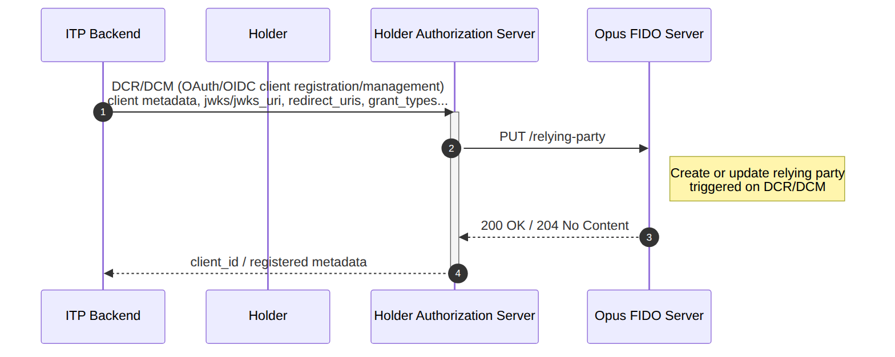

## Purpose

**DCR/DCM** (*Dynamic Client Registration / Dynamic Client Management*) is the process of registering and maintaining the confidential OAuth/OIDC client at the Holder's *Authorization Server*. In the context of the Opus FIDO Server, this process acts as the **relying party (RP) provisioning trigger**: whenever a client is registered or updated, the *Authorization Server* calls the FIDO Server to create or update the RP configuration (identifier, name, and allowed origins) that will be used in the *attestation* and *assertion* ceremonies.

This flow is performed **outside the binding journey** and is a **pre-condition** for all the other flows in this section.

## Pre-conditions

- Holder's *Authorization Server* configured;
- ITP *backend* ready for the integration (OAuth/OIDC client with `jwks`/`jwks_uri`, `redirect_uris`, `grant_types`, etc.).

## Sequence Diagram

## Flow Steps

1. **Client registration/management:** the ITP *backend* performs the DCR/DCM with the Holder's *Authorization Server*, sending the client metadata (`jwks`/`jwks_uri`, `redirect_uris`, `grant_types`, etc.).
2. **RP provisioning:** the *Authorization Server* calls the FIDO Server via `PUT /relying-party`, creating or updating the corresponding relying party.
3. **Confirmation:** the FIDO Server responds `200 OK` or `204 No Content`, and the *Authorization Server* returns the `client_id` and registered metadata to the ITP.

## FIDO Server Endpoint

| Method | Endpoint | Description | Success |
| :----: | :------- | :---------- | :-----: |
| PUT | `/relying-party` | Create or update the relying party (triggered on DCR/DCM) | 200 / 204 |

### Request body (`RelyingPartyRequest`)

| Field | Description |
| :--- | :--- |
| `relyingPartyId` | Relying party identifier (rpId) — typically the domain associated with the client |
| `relyingPartyName` | User-friendly name of the relying party |
| `relyingPartyOrigins` | List of allowed origins for the WebAuthn ceremonies |
| `brandId` | Identifier of the brand associated with the relying party |

> **Important:** Validation of the `rp`/`relyingPartyId` field content against the *CN* of the **BRCAC** certificate, as per the *Open Finance Brasil* documentation, is the Holder's responsibility.

## References

- OpenAPI specification: [`en-opusFidoServer-oas.yaml`](anexos/yml/en-opusFidoServer-oas.yaml) (see also the [associated API][API-FidoServer])
- [W3C WebAuthn-2 — Relying Party](https://www.w3.org/TR/webauthn-2/#relying-party)

[API-FidoServer]: ../../../../swagger-ui/index.html?api=en-oas-fido-server
