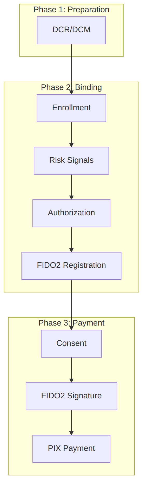

## Opus FIDO Server

The **Opus FIDO Server** is the component of the **Opus Open Finance Platform** responsible for implementing the **FIDO2/WebAuthn** ceremonies — the W3C standard for public-key credential authentication — in the context of the **Redirect-less Journey (JSR)** of *Open Finance Brasil*.

Acting as an **Account Holder**, the institution uses the FIDO Server to register FIDO2 credentials on the user's device (*attestation*) and, later, to validate the signatures generated by those credentials when authorizing payments and transfers (*assertion*). This way, the user approves future transactions using only their device's biometric authentication, without having to log in to the Holder again for each operation.

This section presents the business flows in which the Opus FIDO Server participates, with the sequence diagram of each journey and the API description in the *Open API Specification* standard.

## The FIDO Server's role in the architecture

The FIDO Server is a back-end service consumed by the Holder's *backend* and *Authorization Server*. It is not exposed directly to the Payment Initiator (ITP) or the end user: the Holder orchestrates the calls to the FIDO Server within the regulatory *enrollment* and consent-authorization endpoints.

| Actor | Role |
| :--- | :--- |
| **User** | Account holder; performs the authentication gesture (biometrics/PIN) on the device |
| **ITP App / Backend** | Payment Initiator; drives the redirect-less journey |
| **Holder** | Account-holding institution; orchestrates *enrollment*, authorization, and calls to the FIDO Server |
| **Holder Authorization Server** | Issues and validates tokens (FAPI) and triggers relying party provisioning |
| **Opus FIDO Server** | Runs the FIDO2 *attestation* (registration) and *assertion* (authentication) ceremonies |

## Documents in this section

### [DCR/DCM — Client Registration and Management](dcrDcm.html)

Provisioning of the relying party on the FIDO Server. This is the **pre-condition** for the integration: performed outside the binding journey, whenever a *Dynamic Client Registration/Management* occurs.

### [Device/Account Binding](vinculacaoDeDispositivo.html)

Establishment of the binding between the device and the account at the Holder, including *enrollment* with risk signals, the journey at the Holder (FAPI *hybrid flow*), and the creation and registration of the FIDO2 credential (*attestation*).

### [Redirect-less Payment](pagamentoSemRedirecionamento.html)

Execution of a PIX payment using FIDO2 authentication (*assertion*): consent initiation, transaction signing with the device credential, consent authorization, and settlement.

## Flow Overview

The three journeys are chained: relying party provisioning (DCR/DCM) enables the integration, binding registers the FIDO2 credential on the device and, once the binding is established, payments are authorized by FIDO2 signature.

## Important Points

- Validation of `riskSignals` is the **Holder's sole responsibility**. The Opus FIDO Server is **agnostic** to the content of the risk signals.
- Validation of the `rp` field content against the *CN* of the **BRCAC** certificate in the OFB payloads that involve FIDO — as per the *Open Finance Brasil* documentation — is the Holder's responsibility.
- We recommend using the `enrollmentId` as the `username` in operations with the Opus FIDO Server, to ensure uniqueness and ease the mapping between systems.
- The `displayName` field should be used to display user-friendly information, at the Holder's discretion.

## API Specification

The Opus FIDO Server API is described in the *Open API Specification* standard: [`en-opusFidoServer-oas.yaml`](anexos/yml/en-opusFidoServer-oas.yaml). See also the [associated API][API-FidoServer] rendered in Swagger UI.

[API-FidoServer]: ../../../../swagger-ui/index.html?api=en-oas-fido-server
