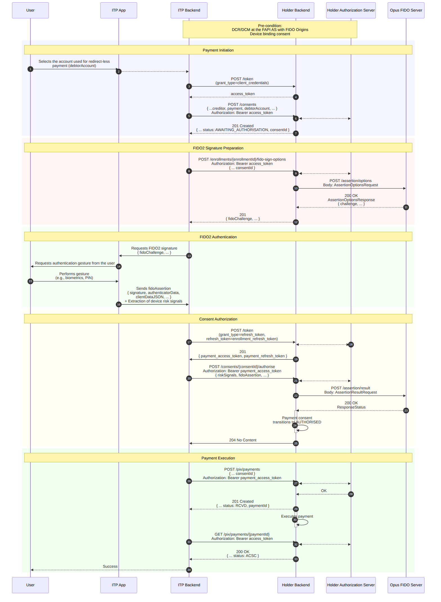

## Purpose

The **Redirect-less Payment** flow executes a PIX payment using the FIDO2 credential previously registered on the device to authenticate the user, following the *Open Finance Brasil* specifications — **Redirect-less Journey (JSR)**. The user approves the transaction directly in the ITP App, by biometrics, without being redirected to the Holder's environment.

In this journey, the Opus FIDO Server runs the ***assertion*** ceremony (WebAuthn authentication): it generates the signing challenge (`/assertion/options`) and validates the signature returned by the device (`/assertion/result`).

## Pre-conditions

- **DCR/DCM** performed at the *Authorization Server* with *FIDO Origins* (see [DCR/DCM](dcrDcm.html));
- **Device binding** already established in the `AUTHORISED` status (see [Device/Account Binding](vinculacaoDeDispositivo.html));
- FIDO2 credential already registered on the device.

## Sequence Diagram

## Flow Steps

### 1. Payment initiation

1. The user selects, in the ITP App, the account used for the redirect-less payment (`debtorAccount`).
2. The *backend* obtains a token via `POST /token` (`grant_type=client_credentials`).
3. The *backend* creates the consent via `POST /consents` (with `creditor`, `payment`, `debtorAccount`). The Holder returns `201 Created` with the `consentId` in the **`AWAITING_AUTHORISATION`** status.

### 2. FIDO2 signature preparation (*assertion options*)

4. The *backend* requests the signing options via `POST /enrollments/{enrollmentId}/fido-sign-options` (providing the `consentId`).
5. The Holder calls the FIDO Server via **`POST /assertion/options`** and returns the `fidoChallenge`.

### 3. FIDO2 authentication

6. The App requests the authentication gesture and the user performs the biometrics/PIN.
7. The App sends the `fidoAssertion` (`signature`, `authenticatorData`, `clientDataJSON`) to the *backend*, along with the extraction of device risk signals.

### 4. Consent authorization (*assertion result*)

8. The *backend* obtains the payment token via `POST /token` (`grant_type=refresh_token`).
9. The *backend* authorizes the consent via `POST /consents/{consentId}/authorise` (with `riskSignals` and `fidoAssertion`).
10. The Holder calls the FIDO Server via **`POST /assertion/result`**. On success, the consent transitions to **`AUTHORISED`**.

### 5. Payment execution

11. The *backend* executes the payment via `POST /pix/payments` (with the `consentId`). The Holder returns `201 Created` in the `RCVD` status.
12. The *backend* queries the payment via `GET /pix/payments/{paymentId}` until the `ACSC` status (settled) and returns success to the user.

## FIDO Server Endpoints

| Method | Endpoint | Description | Success |
| :----: | :------- | :---------- | :-----: |
| POST | `/assertion/options` | Obtain the FIDO2 authentication (signing) challenge | 200 |
| POST | `/assertion/result` | Submit the signature for validation | 200 |

### `AssertionOptionsRequest`

| Field | Description |
| :--- | :--- |
| `username` | User identifier in the ceremony. We recommend using the `enrollmentId` |
| `userVerification` | User verification requirement (e.g., `required`) |
| `extensions` | WebAuthn extensions |

### `AssertionResultRequest`

| Field | Description |
| :--- | :--- |
| `id` / `rawId` | Identifiers of the credential used |
| `response` | `authenticatorData`, `signature`, `userHandle`, and `clientDataJSON` generated by the device |
| `type` | Credential type (`public-key`) |
| `getClientExtensionResults` | Client extension results |

> **Important:** Validation of `riskSignals` is the Holder's sole responsibility — the Opus FIDO Server is agnostic to the content of the risk signals.

## References

- OpenAPI specification: [`en-opusFidoServer-oas.yaml`](anexos/yml/en-opusFidoServer-oas.yaml) (see also the [associated API][API-FidoServer])
- [W3C WebAuthn-2 — getAssertion](https://www.w3.org/TR/webauthn-2/#sctn-getAssertion)
- [Device Binding (ITP perspective)](../iniciacaoDePagamentosERecepcaoDeDados/funcionamento/vinculoDeDispositivo.html)

[API-FidoServer]: ../../../../swagger-ui/index.html?api=en-oas-fido-server
