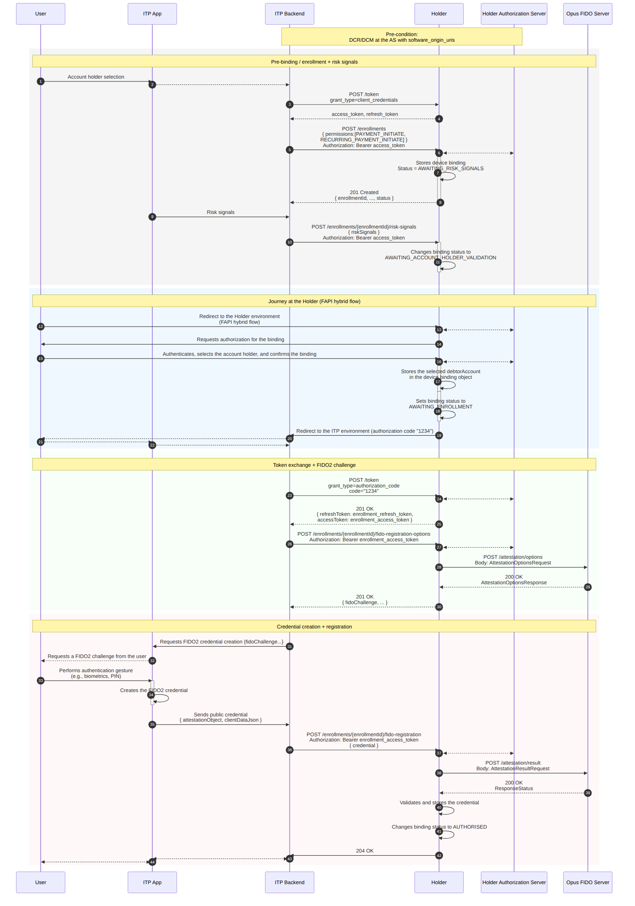

## Purpose

**Device/Account Binding** (*enrollment*) establishes the binding between the user's device and their account at the Holder, following the *Open Finance Brasil* specifications — **Redirect-less Journey (JSR)**. At the end of the flow, a **FIDO2 credential** is registered on the device and ready to authorize future payments by biometrics, without further redirects to the Holder.

In this journey, the Opus FIDO Server runs the ***attestation*** ceremony (WebAuthn credential registration): it generates the credential-creation options (`/attestation/options`) and validates the result returned by the device (`/attestation/result`).

## Pre-conditions

- **DCR/DCM** performed at the *Authorization Server* with `software_origin_uris` (see [DCR/DCM](dcrDcm.html));
- ITP with FIDO2 capabilities.

## Sequence Diagram

## Flow Steps

### 1. Pre-binding — *enrollment* + risk signals

1. The user selects the account Holder in the ITP App.
2. The ITP *backend* obtains a token via `POST /token` (`grant_type=client_credentials`).
3. The *backend* creates the binding via `POST /enrollments` (with `permissions`, e.g., `PAYMENT_INITIATE`, `RECURRING_PAYMENT_INITIATE`). The Holder stores the binding with status **`AWAITING_RISK_SIGNALS`** and returns `201 Created` with the `enrollmentId`.
4. The *backend* sends the risk signals via `POST /enrollments/{enrollmentId}/risk-signals`. The Holder changes the status to **`AWAITING_ACCOUNT_HOLDER_VALIDATION`**.

### 2. Journey at the Holder (FAPI *hybrid flow*)

5. The user is redirected to the Holder's environment and authenticates, selects the account holder, and confirms the binding.
6. The Holder stores the selected `debtorAccount` in the binding object, sets the status to **`AWAITING_ENROLLMENT`**, and redirects back to the ITP environment with the *authorization code*.

### 3. Token exchange + FIDO2 challenge (*attestation*)

7. The *backend* exchanges the code for tokens via `POST /token` (`grant_type=authorization_code`), receiving `enrollment_access_token` and `enrollment_refresh_token`.
8. The *backend* requests the registration options via `POST /enrollments/{enrollmentId}/fido-registration-options`.
9. The Holder calls the FIDO Server via **`POST /attestation/options`** and returns the `fidoChallenge` to the *backend* (compatible with [W3C WebAuthn-2][webauthn-makecred]).

### 4. Credential creation + registration (*attestation result*)

10. The App requests the authentication gesture (biometrics/PIN) from the user and **creates the FIDO2 credential** on the device.
11. The App sends the public credential (`attestationObject`, `clientDataJson`) to the *backend*, which forwards it via `POST /enrollments/{enrollmentId}/fido-registration`.
12. The Holder calls the FIDO Server via **`POST /attestation/result`**. On success, it validates and stores the credential and changes the binding status to **`AUTHORISED`**.

## FIDO Server Endpoints

| Method | Endpoint | Description | Success |
| :----: | :------- | :---------- | :-----: |
| POST | `/attestation/options` | Obtain the FIDO2 credential registration (creation) options | 200 |
| POST | `/attestation/result` | Submit the registration result for validation and storage | 200 |

### `AttestationOptionsRequest`

| Field | Description |
| :--- | :--- |
| `username` | User identifier in the ceremony. We recommend using the `enrollmentId` |
| `displayName` | User-friendly name shown to the user, at the Holder's discretion |
| `authenticatorSelection` | Authenticator selection criteria (`authenticatorAttachment`, `userVerification`, `residentKey`, `requireResidentKey`) |
| `attestation` | Attestation conveyance preference |
| `extensions` | WebAuthn extensions |

### `AttestationResultRequest`

| Field | Description |
| :--- | :--- |
| `id` / `rawId` | Identifiers of the created credential |
| `response` | `clientDataJSON` + `attestationObject` generated by the device |
| `type` | Credential type (`public-key`) |
| `authenticatorAttachment` | Authenticator attachment (`platform`/`cross-platform`) |
| `getClientExtensionResults` | Client extension results |

## Binding state machine

| Status | How it is reached | Next step |
| :----- | :---------------- | :-------- |
| `AWAITING_RISK_SIGNALS` | `POST /enrollments` returns 201 | Send `/risk-signals` |
| `AWAITING_ACCOUNT_HOLDER_VALIDATION` | After `/risk-signals` is accepted | Redirect the user to the Holder |
| `AWAITING_ENROLLMENT` | User approves at the Holder (OIDC OK) | Register the FIDO2 credential |
| `AUTHORISED` | FIDO2 credential successfully registered | Binding ready to authorize payments |

> **Important:** Validation of `riskSignals` is the Holder's sole responsibility — the Opus FIDO Server is agnostic to the content of the risk signals.

## References

- OpenAPI specification: [`en-opusFidoServer-oas.yaml`](anexos/yml/en-opusFidoServer-oas.yaml) (see also the [associated API][API-FidoServer])
- [SV Vínculo de Dispositivo — Open Finance Brasil](https://openfinancebrasil.atlassian.net/wiki/spaces/OF/pages/1436516353/v2.2.0+-+SV+V+nculo+de+dispositivo)
- [W3C WebAuthn-2 — makeCredentialOptions][webauthn-makecred]

[API-FidoServer]: ../../../../swagger-ui/index.html?api=en-oas-fido-server
[webauthn-makecred]: https://www.w3.org/TR/webauthn-2/#dictionary-makecredentialoptions
