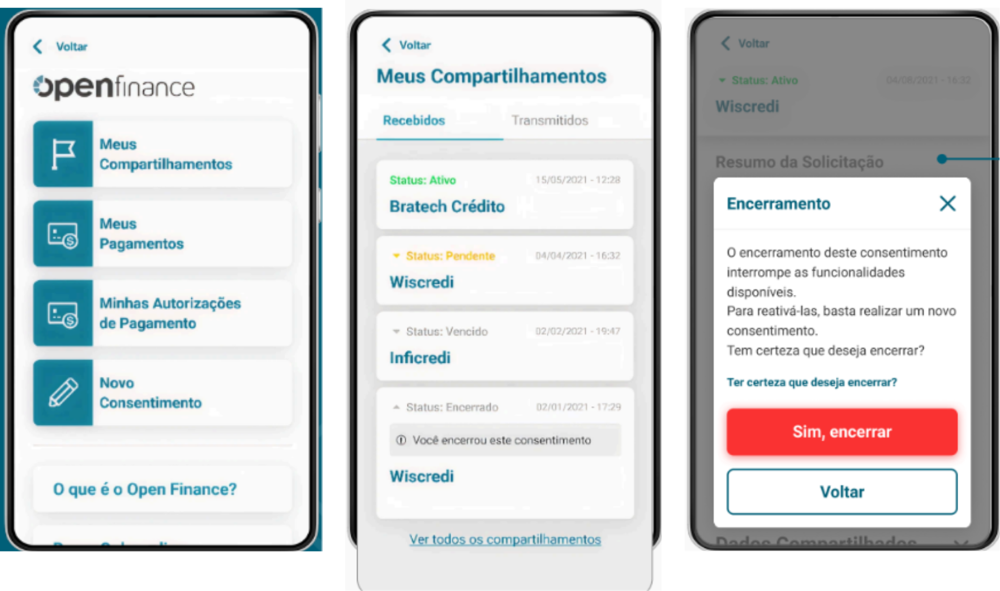

## Lo que implementa nuestra solución

Una vez que el usuario inicia sesión a través de su aplicación, tendrá acceso a una serie de pantallas en conformidad con la regulación más actualizada del Banco Central.

Nuestro objetivo es asegurar que, a lo largo de toda la jornada de Open Finance, los clientes tengan **control total** sobre sus **datos** y las **permisiones de compartición**, gestionando de manera sencilla y eficiente sus cuentas vinculadas y consentimientos.

Las pantallas desarrolladas están organizadas en:

- **Pantallas de Gestión (Transmisión y Recepción de Datos)**, que posibilitan la gestión de consentimientos y vínculos de cuentas, proporcionando control total sobre la información compartida.

Tras la autenticación del usuario, este tendrá acceso a las pantallas descritas:

### Transmisión - Pantallas de Gestión (Ítem 05 - Área de Gestión)

**Observación:** Las pantallas presentadas en esta sección están contenidas en la Guía de Experiencia del Usuario, Ítem 05 – Área de Gestión. Más detalles en el [enlace](https://openfinancebrasil.atlassian.net/wiki/spaces/OF/pages/1477279745/v.19.00.01+Guia+de+Experi+ncia+do+Usu+rio+Open+Finance+Brasil).

Las pantallas de gestión están enfocadas en la gestión de los consentimientos de Open Finance. Estas pantallas proporcionan al usuario un control claro y eficiente sobre sus comparticiones de datos, autorizaciones de pago y vínculos de cuentas.

#### Pantalla 1: Panel de Control de Consentimientos - Transmisión

Presenta todos los consentimientos activos e inactivos, permitiendo al usuario visualizar y revocar. Cada consentimiento se detalla con información como la fecha de validez y las instituciones involucradas.

#### Pantalla 2: Revocación de Consentimiento

El usuario puede revocar un consentimiento directamente desde esta pantalla, recibiendo un aviso de que esta acción es irreversible y qué servicios se verán afectados.

#### Pantalla 3: Gestión de Cuentas Vinculadas

Muestra todos los vínculos de cuentas del flujo de Jornada Sin Redirección (JSR) en Open Finance, permitiendo al usuario visualizar o revocar los vínculos. La información sobre cada cuenta, como el tipo de vínculo y la validez, se muestra claramente.

### Recepción - Pantallas de Gestión (Ítem 05 - Área de Gestión)

**Observación:** Las pantallas presentadas en esta sección están contenidas en la Guía de Experiencia del Usuario, Ítem 05 – Área de Gestión. Más detalles en el enlace.

Las pantallas de gestión están enfocadas en la gestión de los consentimientos de Open Finance. Estas pantallas proporcionan al usuario un control claro y eficiente sobre sus consentimientos de recepción de datos, compartición de datos y pagos.

#### Pantalla 1: Panel de Control de Consentimientos - Recepción

#### Pantalla 2: Listado de Comparticiones (Recibidas y Transmitidas)

Presenta todos los consentimientos activos e inactivos, permitiendo al usuario visualizar y revocar. Cada consentimiento se detalla con información como la fecha de creación y las instituciones involucradas.

#### Pantalla 3: Revocación de Consentimiento

El usuario puede revocar un consentimiento directamente desde esta pantalla, recibiendo un aviso de que esta acción es irreversible y qué servicios se verán afectados.

