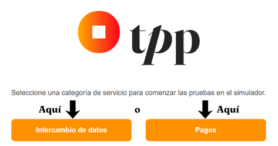
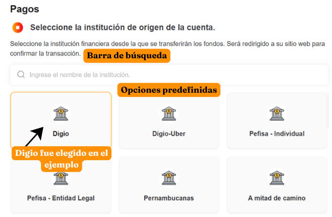
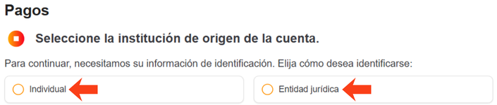
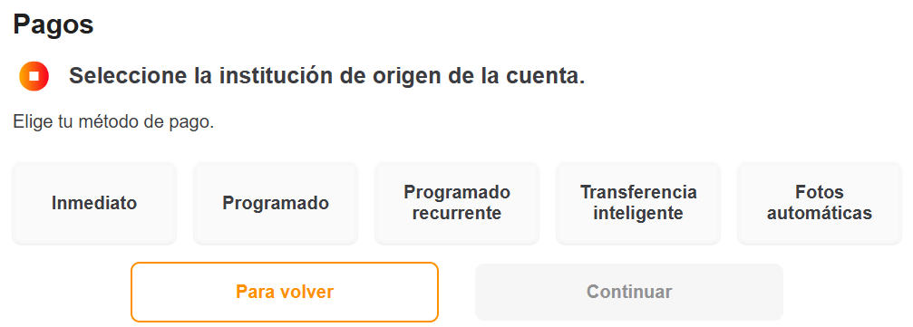
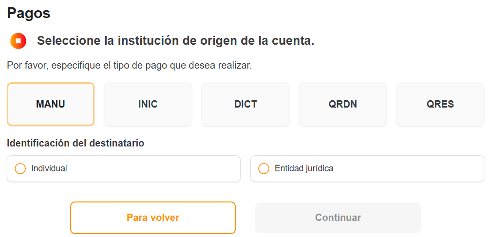
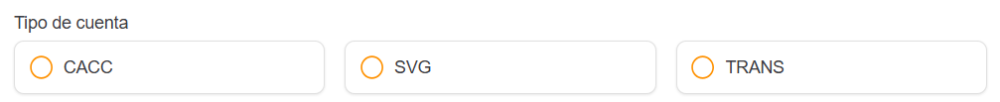
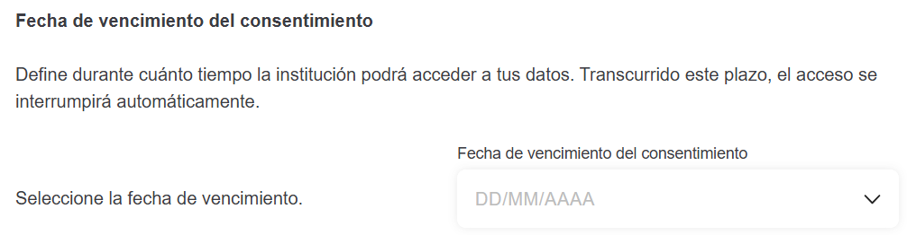
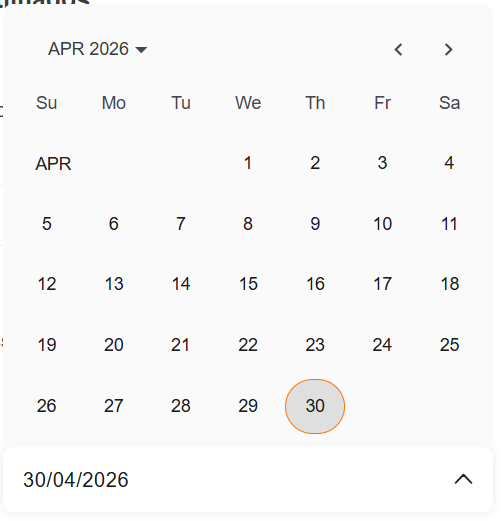

## Introducción

Esta guía proporciona explicaciones sobre la herramienta **OpusTPP** e instrucciones detalladas para:

- ✔ Navegar por la interfaz intuitiva de la herramienta;
- ✔ Completar correctamente los campos obligatorios;
- ✔ Validar transacciones de manera segura;
- ✔ Resolver errores comunes.

Siguiendo las orientaciones presentadas, podrá aprovechar todas las funcionalidades de **OpusTPP** de manera simple y eficiente.

## ¿Qué es OpusTPP?

Opus TPP es una plataforma avanzada desarrollada para simplificar la **simulación** y **ejecución** de operaciones en el ecosistema de Open Finance, incluyendo:

- Pagos instantáneos:
  - Inmediato;
  - Programado;
  - Programado recurrente;
  - Transferencias inteligentes;
  - Pix Automático.
- Compartición de datos (consentimiento de información financiera).

## Términos y Definiciones

Antes de comenzar con las instrucciones de uso, aquí se presenta una explicación de términos técnicos o específicos utilizados en el sitio:

- **DICT:** Documento de Inicio de Cobro vía PIX (estándar BACEN).
- **QRDN/QRES:** Código QR Dinámico (QRDN) o Estático (QRES) para pagos vía PIX.
- **INIC:** Inicio de pago mediante códigos específicos.
- **Consentimiento:** Autorización formal para compartir datos entre instituciones.

## Instrucciones

El primer paso es seleccionar qué categoría de servicio desea probar. Elija entre **Pagos** y **Compartición de Datos**.

### **Pagos**

#### 1. Cuenta de origen

En esta etapa, debe seleccionar la institución financiera desde donde se transferirá el valor. Puede elegir una institución predefinida en pantalla o buscar la institución deseada mediante la barra de búsqueda ubicada al inicio de la página:

>**EJEMPLO:**
>Escriba "Digio" para filtrar.

#### 2. Validación inicial

Aquí debe elegir cómo será identificado:

- Persona Física;
- Persona Jurídica.

Si elige Persona Física, deberá informar el CPF del pago. Si elige Persona Jurídica, también deberá agregar el CNPJ.
Después de completar correctamente los campos obligatorios, podrá continuar al siguiente paso.

#### 3. Modalidad de pago

Aquí, seleccione la modalidad de pago que se realizará. Puede elegir entre:

- Inmediato;
- Programado;
- Programado recurrente;
- Transferencia inteligente;
- Pix Automático.

| Modalidad | Campos Adicionales |
| :-------: | :----------------: |
| **Programado recurrente** | Fecha final e intervalo de repetición |
| **Transferencia inteligente** | Frecuencia (diaria/semanal/mensual/anual), período de validez (horas/días) |
| **Pix Automático** | Frecuencia (semanal/mensual/trimestral/semestral/anual), período de validez |

>**OBSERVACIÓN:**
>Los campos dinámicos se mostrarán según la modalidad seleccionada.

#### 4. Método de inserción

Aquí debe seleccionar entre las cinco opciones disponibles cómo se ingresarán los datos del receptor del pago, ya sea Persona Física o Jurídica.

Complete los campos editables de cada método (los cinco) y seleccione cerca del final de la página el tipo de cuenta del receptor:

- **INIC y DICT:** Después de completar la información, ingrese la clave Pix del receptor.
- **QRDN:** Después de completar la información, ingrese la clave Pix del receptor y el código QR Dinámico.
- **QRES:** Después de completar la información, ingrese la clave Pix del receptor y el código QR Estático.

#### 5. Redirección al banco

Espere la redirección para confirmar la operación. Una vez recibida la confirmación del banco emisor, ¡el proceso habrá finalizado!

>**TIEMPO PROMEDIO:**
>Aproximadamente 5–15 segundos para Pix.

### **Compartición de Datos**

#### 1. Cuenta de origen - Compartición de Datos

En esta etapa, debe seleccionar la institución financiera desde donde se transferirá el valor. Puede elegir una institución predefinida en pantalla o buscar la institución deseada mediante la barra de búsqueda ubicada al inicio de la página:

>**EJEMPLO:**
>Escriba "Digio" para filtrar.

#### 2. Validación inicial - Compartición de Datos

Aquí debe elegir cómo será identificado:

- Persona Física;
- Persona Jurídica.

Si elige Persona Física, deberá informar el CPF del pago. Si elige Persona Jurídica, también deberá agregar el CNPJ.
Después de completar correctamente los campos obligatorios, podrá continuar al siguiente paso.

#### 3. Selección de datos

En esta etapa, por defecto, todas las opciones estarán **seleccionadas**, lo que significa que todos los datos presentes serán compartidos.

Los tipos de datos de consentimiento presentes en la página son:

- **Datos de registro;**
- **Tarjeta de crédito;**
- **Cuentas;**
- **Préstamos;**
- **Financiaciones;**
- **Adelantos a depositantes;**
- **Derechos crediticios descontados;**
- **Renta fija bancaria;**
- **Renta fija de crédito;**
- **Renta variable;**
- **Bonos del tesoro;**
- **Fondos de inversión;**
- **Cambio;**
- **Recursos.**

Al final de la lista es posible definir el período de validez del consentimiento de los datos seleccionados. Este período define durante cuánto tiempo sus datos podrán ser accedidos por la institución. La definición se realiza mediante una caja de selección como se muestra en la imagen:

Al hacer clic en la caja de selección, se abrirá un calendario:

Después de elegir el período deseado, continúe con el siguiente paso.

#### 4. Revisión de datos

Esta es la etapa donde podrá revisar de manera segura los datos que serán compartidos con su institución. Puede visualizar los datos seleccionados y completados en una lista resumida en pantalla.

Si desea editar alguna información, simplemente vuelva atrás, realice la edición y luego regrese a esta pantalla.

Si decide continuar, autorizará el intercambio de los datos seleccionados y revisados mediante este botón:

**¡Y listo! La compartición de datos ha sido autorizada y realizada.**
