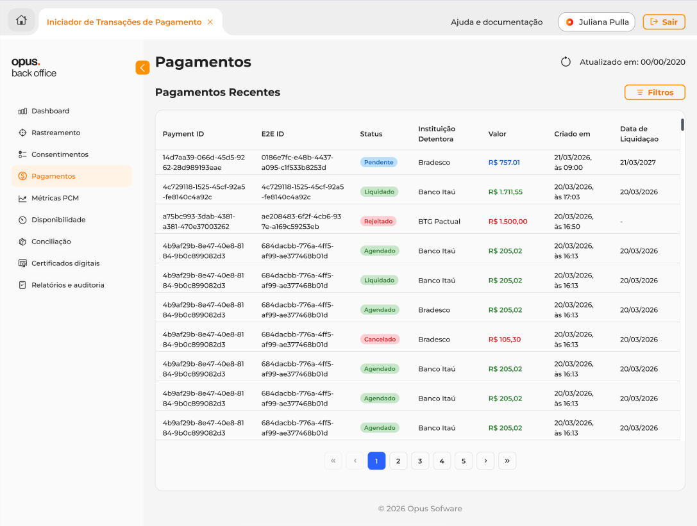
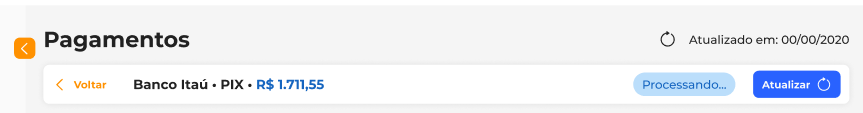
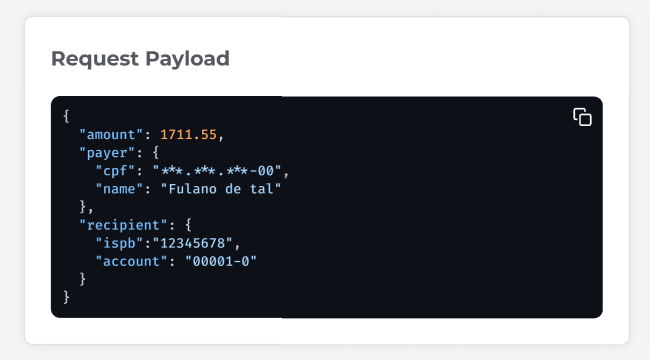

## Introducción

El Portal Backoffice tiene como objetivo permitir la **visualización, consulta y trazabilidad de pagos**, ofreciendo información detallada sobre cada transacción, su estado y datos relacionados, garantizando visibilidad completa del flujo desde la creación hasta la liquidación o fallo.

Esta documentación describe las funcionalidades disponibles en las pantallas del sistema, así como el comportamiento esperado de cada campo y acción, ayudando en el uso y desarrollo de la aplicación.

---

## Pantalla 01 – Inicio de Sesión

### **Descripción - Inicio de Sesión**

Pantalla inicial del sistema responsable de la autenticación del usuario.

### **Campos**

- **Usuario;**
- **Contraseña.**

### **Reglas y Comportamiento**

- Después de una autenticación exitosa, el usuario debe ser redirigido automáticamente a la **Pantalla 02 – Listado de Pagos**.
- El método de autenticación aún está en definición.
- No se recomienda utilizar credenciales fijas definidas manualmente debido a riesgos de seguridad.

---

## Pantalla 02 – Listado de Pagos

### Descripción

Muestra todos los pagos registrados en el sistema, permitiendo búsqueda y filtrado.

### Campos del Listado

- **Payment ID:** Identificador único del pago;
- **E2E ID:** Identificador del flujo Pix;
- **Estado:** Estado actual del pago;
- **Institución Titular:** Banco responsable del pago;
- **Valor:** Valor monetario;
- **Creado en:** Fecha/hora de creación;
- **Fecha de Liquidación:** Fecha prevista o realizada de liquidación.

### Estados Posibles

Para información más detallada, acceda a [este enlace](https://openfinancebrasil.atlassian.net/wiki/spaces/OF/pages/1600030369/M+quina+de+Estados+-+v5.0.0-rc.1+-+SV+Pagamentos).

| Nombre “Natural”            | Código |
| :-------------------------: | :----: |
| Solicitud recibida          | RCVD   |
| Cancelado por el usuario    | CANC   |
| Pix listo                   | ACCP   |
| Pix enviado para liquidación| ACPD   |
| Pix rechazado               | RJCT   |
| Pix liquidado               | ACSC   |
| Pix pendiente               | PDNG   |
| Pix programado              | SCHD   |

### Filtros del listado

#### Campos Fijos

- Institución Titular;
- Estado.

#### Filtro por ID

- Tipo de ID:
  - Payment ID;
  - E2E ID;
  - Internal ID;
  - Consent ID;
- Campo de búsqueda libre.

#### Filtro por Fecha

- Fecha inicial (Desde);
- Fecha final (Hasta).

### Reglas

- Al aplicar filtros, el botón debe mostrar una **“X”** para limpiar la selección.
- Sin pagos registrados:

  > “No se encontraron pagos. Inicie un nuevo pago para visualizarlo.”
- Sin resultados en el filtro:

  > “Ningún pago corresponde a los filtros seleccionados. Ajuste los filtros e inténtelo nuevamente.”
- Solo el menú **“Pagos”** debe estar disponible en la barra lateral.
- Al seleccionar un pago, el usuario será redirigido a la **Pantalla 03 – Detalles del Pago**.

---

## Pantalla 03 – Detalle de un Pago

### Descripción de la pantalla

Presenta toda la información detallada de un pago específico.

### Secciones de la pantalla de detalles

---

### Encabezado

### Campos

- Institución Titular;
- Tipo: PIX (fijo);
- Valor (con color basado en el estado);
- Estado;
- Actualizado en.

### Acciones

- **Volver:** Regresa al listado manteniendo los filtros;
- **Actualizar:** Consulta el estado más reciente en la institución.

---

### IDs Correlacionables

### Campos de IDs

- Payment ID;
- E2E ID;
- Internal ID;
- Consent ID.

### Acciones de la página

- **Copiar:** Copia el valor al portapapeles;
- **Seleccionar Consent ID:** Redirige al listado filtrado.

### Mensaje

> “Haga clic en el Consent ID para consultar los pagos vinculados a este consentimiento.”

---

### Timeline (Línea de Tiempo)

### Campos del Timeline

Cada evento contiene:

- Estado (título);
- Fecha y hora;
- FAPI Interaction ID.

### Reglas del Timeline

- Mostrar únicamente los eventos informados por la institución titular;
- La cantidad de eventos puede variar.

---

### Detalles

### Pago

- Creado (fecha/hora);
- Actualizado (fecha/hora);
- Moneda.

### Regla

- Si no hay actualización, repetir la fecha de creación.

---

### Consentimiento

### Ejemplos de Campos (PIX)

- Fecha del consentimiento;
- Identificador;
- Destinatario;
- CPF/CNPJ;
- Solicitante;
- Deudor.

### Reglas del campo

- Los datos son solo para visualización;
- **No se permite editar ningún campo.**

---

### Request Payload

### Descripción del Request

Muestra el payload enviado por la institución cliente.

### Regla del Request

Si no existe:

> “Request Payload no disponible para este pago.”

---

### Response Payload

### Descripción del Response

Muestra el payload retornado por el sistema.

### Regla del Response

Si no existe:

> “Response Payload no disponible para este pago.”

---

### Registro de Error

### Descripción del Registro de Error

Muestra el motivo de la falla en el pago.

### Visualización Condicional

Solo para los estados:

- `CANC`;
- `RJCT`.

### Regla del Registro de Error

Si no existe:

> “Registro de error no disponible para este pago.”
