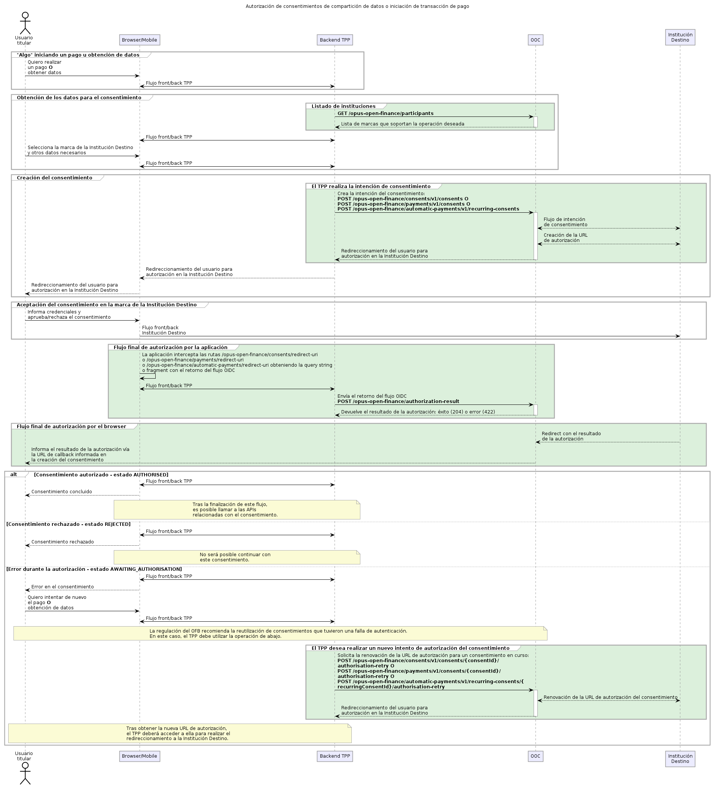
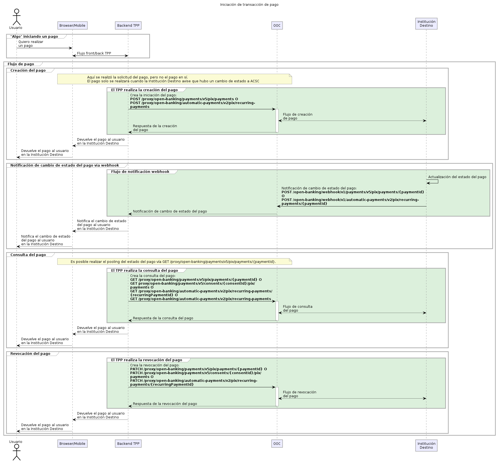
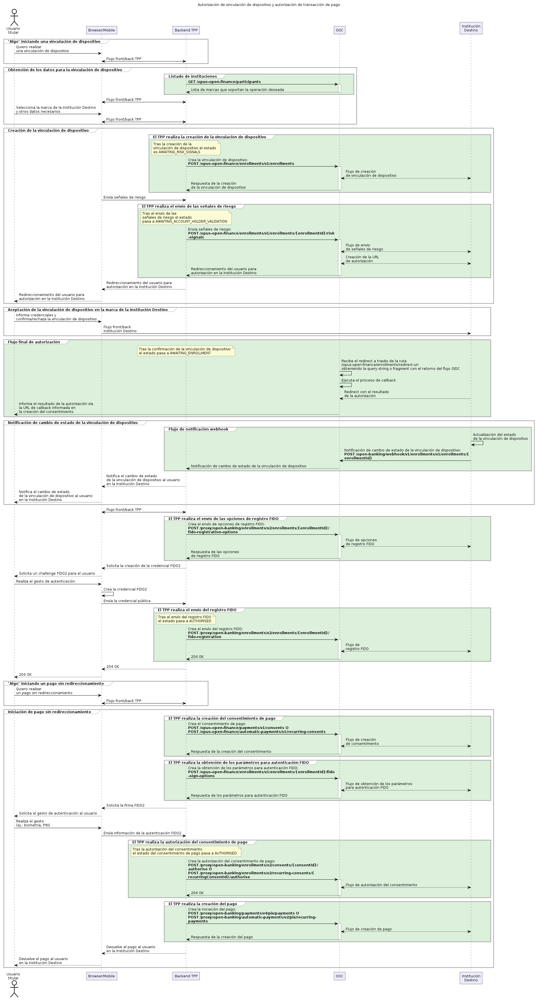

## Funcionamiento: Iniciación de pago y recepción de datos

Este documento describe, a alto nivel, los principales flujos de negocio soportados por el Módulo de Iniciación de Pagos y mediante el Módulo de Recepción de Datos para la integración con el ecosistema del Open Finance Brasil. Cada flujo tiene una página dedicada con detalles técnicos, payloads y códigos de error — use los enlaces a lo largo del texto.

## Flujo de Solicitud de Consentimiento

El consentimiento es la autorización concedida por el usuario para que una institución Iniciadora de Pago (ITP) pueda acceder a sus datos o realizar pagos en su nombre. El flujo de solicitud es similar para ambas finalidades (recepción de datos e iniciación de pago), diferenciándose únicamente en una llamada específica.

### Diagrama de Secuencia - Open Finance

### Etapas del Flujo

#### 1. Listado de las Instituciones Participantes

**Endpoint:** `GET /opus-open-finance/participants`

**Objetivo:** Identificar las instituciones disponibles para el consentimiento.

Esta llamada devuelve la lista de *marcas* de instituciones registradas en el Directorio de Participantes del Open Finance Brasil que soportan las operaciones deseadas.

Las instituciones se clasifican por sus funciones:

| Tipo | Descripción | Finalidad |
| ---- | --------- | ---------- |
| **[Transmisora de Datos](../../../openFinanceBrasil/perfisParticipacao/transmissorDeDados.html)** | Institución que comparte información | Permite el acceso a datos registrales y transaccionales |
| **[Institución Titular](../../../openFinanceBrasil/perfisParticipacao/detentorDeContas.html)** | Institución que custodia la cuenta del usuario | Permite operaciones de iniciación de pago |

> **Importante:** El `AuthorisationServerId` de la marca seleccionada debe utilizarse en el header `x-authorisation-server-id` de todas las llamadas subsiguientes.

**Filtros disponibles:**

- **role (rol regulador):** DADOS, PAGTO, CONTA, CCORR;
- **familyType (familia de APIs):** Define qué recursos ofrece la institución (ej.: "customers-business").

#### 2. Creación de la Intención de Consentimiento

**Objetivo:** Registrar la intención de la ITP de acceder a datos o realizar pagos en nombre del usuario.

**Endpoints por tipo de operación:**

| Finalidad | Endpoint |
| :--------: | :------: |
| Recepción de Datos | `POST /opus-open-finance/consents/v1/consents` |
| Iniciación de Pago | `POST /opus-open-finance/payments/v1/consents` |
| Iniciación de Pago Automático | `POST /opus-open-finance/automatic-payments/v1/recurring-consents` |

**Comportamiento:**

- La llamada envía a la Institución Destino la información del consentimiento deseado;
- La respuesta `HTTP 201 Created` indica creación exitosa;
- El payload devuelve el `consentId`, identificador único del consentimiento;
- Estado inicial: **AWAITING_AUTHORISATION** (aguardando autorización del usuario).

> Para detalles del payload, vea [Recepción de Datos](recepcaoDeDados.html).

#### 3. Redireccionamiento para Autorización

Tras la creación del consentimiento, el usuario debe ser redireccionado al entorno de la Institución Destino, donde:

- Visualiza la información del consentimiento solicitado;
- Aprueba o rechaza la solicitud;
- Es redireccionado de vuelta a la aplicación ITP al final del proceso.

**Consideraciones para aplicaciones mobile:**

- La aplicación debe interceptar las URLs de redireccionamiento;
- Tras el redireccionamiento, debe accionar el endpoint `authorization-result` con el resultado del flujo OIDC;
- **Es obligatoria** la implementación de la ruta de redirect web como contingencia, garantizando que el usuario conozca el resultado incluso cuando la URL se abre en otra aplicación.

#### 3.1. Nuevo Intento de Autorización

En casos de falla en el redireccionamiento (ej.: timeout, error 500 del servidor), el BACEN recomienda la **reutilización de la misma intención de consentimiento**.

**Endpoints para nuevo intento:**

| Finalidad | Endpoint |
| :--------: | :------: |
| Recepción de Datos | `POST /opus-open-finance/consents/v1/consents/{consentId}/authorisation-retry` |
| Iniciación de Pago | `POST /opus-open-finance/payments/v1/consents/{consentId}/authorisation-retry` |

> **Plazo para nuevo intento:** Disponible mientras el estado sea **AWAITING_AUTHORISATION** (5 minutos para pago, 60 minutos para compartición de datos).

#### 4. Retorno del Resultado de la Autorización

Tras el redireccionamiento, la aplicación ITP encamina el resultado al Módulo de Iniciación de Pagos.

**Resultados posibles:**

| Decisión del Usuario | Estado del Consentimiento | Acciones del Sistema |
| :----------------: | :---------------------: | :--------------: |
| Aprueba | **AUTHORISED** | Los tokens de acceso se generan y almacenan automáticamente |
| Rechazo | **REJECTED** | Flujo finalizado |
| Aguardando | **AWAITING_AUTHORISATION** | Permite un nuevo intento |

Los tokens generados son gestionados por el Módulo de Iniciación de Pagos y utilizados de forma transparente en las etapas de utilización del consentimiento.

---

## Utilización del Consentimiento

Tras la aprobación, el consentimiento puede utilizarse para:

| Tipo de Consentimiento | Finalidad | Página de detalles |
| :-------------------: | :--------: | :----------------: |
| Recepción de Datos | Obtención de datos registrales y transaccionales | [Recepción de Datos — OF](recepcaoDeDados.html) |
| Iniciación de Pago | Creación y ejecución de pagos | [Iniciación de Pago](iniciacaoDePagamento.html) |
| Pago Automático | Creación y gestión de pagos recurrentes | [Pago Automático](pagamentoAutomatico.html) |

> **Atención:** Los consentimientos de datos y de pago son independientes. Un consentimiento de lectura de datos **no puede** ser utilizado para crear pagos, y viceversa.

---

## Flujo de Solicitud de Iniciación de Pago

La iniciación del pago debe ocurrir **después** de la autorización del consentimiento de pago. Este flujo utiliza las APIs de proxy para efectivizar la transacción.

Para detalles técnicos (versiones v4 y v5, códigos de error JWT, ejemplos de payload), consulte la documentación específica de [Iniciación de Pago](iniciacaoDePagamento.html) y [Pago Automático](pagamentoAutomatico.html).

---

## Flujo de Solicitud de Vinculación de Dispositivo

La vinculación de dispositivo permite que el usuario autorice un dispositivo (ej.: celular, computadora) para aprobar transacciones utilizando autenticación FIDO2 (biometría, PIN), proporcionando mayor seguridad y practicidad.

### Etapas del Flujo de Solicitud de Vinculación de Dispositivo

#### 1. Listado de las Instituciones Participantes del Flujo de Solicitud de Vinculación de Dispositivo

Mismo proceso descrito en el Flujo de Solicitud de Consentimiento descrito más arriba.

#### 2. Creación de la Vinculación de Dispositivo

**Endpoint:** `POST /opus-open-finance/enrollments/v1/enrollments`

Esta llamada registra la intención de crear una vinculación de dispositivo. El vínculo puede configurarse para aprobar:

- Consentimientos de pago;
- Transferencias inteligentes.

> **Importante:** Para soportar ambos tipos, es necesario crear dos vínculos distintos, cada uno con sus permisos específicos.

**Estado inicial:** **AWAITING_RISK_SIGNALS**

**Selección de Versión Regulatoria:**

- Si se envía el header `x-regulatory-v`, el sistema intenta usar la versión solicitada;
- Si no se envía, utiliza la versión más actual disponible;
- El header `x-selected-regulatory-v` en la respuesta indica la versión efectivamente utilizada.

#### 3. Envío de las Señales de Riesgo

**Endpoint:** `POST /opus-open-finance/enrollments/v1/enrollments/{enrollmentId}/risk-signals`

Envía a la Institución Destino las señales de riesgo recolectadas (ej.: datos del dispositivo, localización). La respuesta contiene la URL para el redireccionamiento del usuario.

**Estado tras esta etapa:** **AWAITING_ACCOUNT_HOLDER_VALIDATION**

#### 4. Redireccionamiento para Autorización

El usuario es redireccionado a la Institución Destino, donde podrá:

- Definir límites para transacciones;
- Configurar la fecha de expiración del vínculo;
- Nombrar el dispositivo;
- Confirmar o rechazar el vínculo.

#### 5. Retorno del Resultado de la Autorización

Tras la confirmación (o rechazo), el resultado es procesado por el Módulo de Iniciación de Pagos, que:

- Gestiona el retorno del flujo OIDC;
- Realiza el callback para la generación de tokens;
- Redirecciona al usuario de vuelta a la aplicación ITP.

**Resultados posibles:**

| Decisión | Estado del Vínculo |
| :-----: | :---------------: |
| Confirmación | **AWAITING_ENROLLMENT** |
| Rechazo | **REJECTED** |

#### 6. Envío de las Opciones de Registro FIDO

**Endpoint:** `POST /proxy/open-banking/enrollments/v2/enrollments/{enrollmentId}/fido-registration-options`

Solicita a la Institución Destino la información necesaria para iniciar el registro de la credencial FIDO2.

#### 7. Envío del Registro FIDO

**Endpoint:** `POST /proxy/open-banking/enrollments/v2/enrollments/{enrollmentId}/fido-registration`

Después de que el usuario realice el gesto de autenticación (ej.: biometría, PIN) y la credencial FIDO2 sea creada en el dispositivo, los datos se envían a la Institución Destino.

**Estado final:** **AUTHORISED**

#### 8. Creación de la Intención de Pago

Con el vínculo aprobado, la ITP puede crear una intención de pago:

| Flujo | Endpoint |
| :---: | :------: |
| Pago estándar | `POST /opus-open-finance/payments/v1/consents` |
| Transferencias Inteligentes | `POST /opus-open-finance/automatic-payments/v1/recurring-consents` |

#### 9. Obtención de los Parámetros para Autenticación FIDO

**Endpoint:** `POST /opus-open-finance/enrollments/v1/enrollments/{enrollmentId}/fido-sign-options`

Solicita los parámetros para que el usuario realice la autenticación FIDO2. El cuerpo de la solicitud debe contener el ID del consentimiento creado:

- Para pago estándar: `consentId`;
- Para transferencias inteligentes: `recurringConsentId`.

#### 10. Autorización del Consentimiento de Pago

**Endpoints según el tipo:**

- `POST /proxy/open-banking/enrollments/v2/consents/{consentId}/authorise`
- `POST /proxy/open-banking/enrollments/v2/recurring-consents/{recurringConsentId}/authorise`

Envía las señales de riesgo y los datos de la aserción FIDO2 a la Institución Destino.

**Estado tras la autorización:** **AUTHORISED**

Con el consentimiento autorizado, la iniciación del pago sigue el estándar de los demás flujos.

> El payload completo de `risk-signals`, las reglas de divergencia de cuenta de débito y la máquina de estados completa están en [Vínculo de Dispositivo](vinculoDeDispositivo.html).

---

## Flujo Jornada Optimizada

### Concepto

La Jornada Optimizada simplifica la experiencia del usuario al permitir la compartición de datos de la cuenta en el mismo flujo de un pago. Esto reduce problemas como pagos sin saldo disponible, ya que la ITP puede consultar el saldo antes de solicitar el pago.

### Cómo Funciona

En el flujo de Jornada Optimizada, se generan **dos consentimientos**:

| Tipo | Descripción |
| :--: | :-------: |
| **Primario (Pago)** | Consentimiento principal que autoriza el pago |
| **Secundario (Datos)** | Consentimiento vinculado que autoriza el acceso a datos de la cuenta |

### Relación entre los Consentimientos

- El consentimiento secundario puede ser revocado sin afectar al consentimiento primario;
- Si el consentimiento primario es revocado, el secundario también se revoca automáticamente;
- Si solo se cancela el consentimiento de datos, el usuario deberá conceder uno nuevo para que el acceso al saldo sea restablecido.

### Flujo de Autorización

Cuando el usuario aprueba el consentimiento primario:

- El consentimiento secundario es aprobado automáticamente;
- La ITP puede acceder a los datos de la cuenta usando el ID del consentimiento secundario;
- El flujo de pago sigue normalmente.
