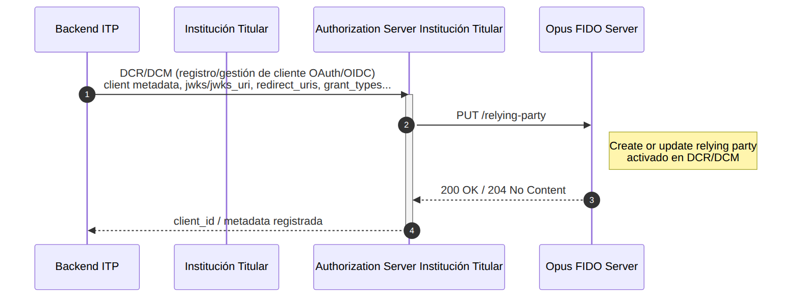

## Objetivo

El **DCR/DCM** (*Dynamic Client Registration / Dynamic Client Management*) es el proceso de registro y mantenimiento del cliente confidencial OAuth/OIDC en el *Authorization Server* de la Institución Titular. En el contexto del Opus FIDO Server, este proceso funciona como **disparador de aprovisionamiento del relying party (RP)**: siempre que un cliente es registrado o actualizado, el *Authorization Server* llama al FIDO Server para crear o actualizar la configuración de RP (identificador, nombre y orígenes permitidos) que se utilizará en las ceremonias de *attestation* y *assertion*.

Este flujo se ejecuta **fuera de la jornada de vinculación** y es **precondición** para todos los demás flujos de esta sección.

## Precondiciones

- *Authorization Server* de la Institución Titular configurado;
- *Backend* del ITP preparado para la integración (cliente OAuth/OIDC con `jwks`/`jwks_uri`, `redirect_uris`, `grant_types`, etc.).

## Diagrama de Secuencia

## Etapas del Flujo

1. **Registro/gestión del cliente:** el *backend* del ITP realiza el DCR/DCM con el *Authorization Server* de la Institución Titular, enviando los metadatos del cliente (`jwks`/`jwks_uri`, `redirect_uris`, `grant_types`, etc.).
2. **Aprovisionamiento del RP:** el *Authorization Server* llama al FIDO Server vía `PUT /relying-party`, creando o actualizando el relying party correspondiente.
3. **Confirmación:** el FIDO Server responde `200 OK` o `204 No Content`, y el *Authorization Server* devuelve al ITP el `client_id` y los metadatos registrados.

## Endpoint del FIDO Server

| Método | Endpoint | Descripción | Éxito |
| :----: | :------- | :---------- | :---: |
| PUT | `/relying-party` | Crea o actualiza el relying party (activado en DCR/DCM) | 200 / 204 |

### Cuerpo de la solicitud (`RelyingPartyRequest`)

| Campo | Descripción |
| :--- | :--- |
| `relyingPartyId` | Identificador del relying party (rpId) — normalmente el dominio asociado al cliente |
| `relyingPartyName` | Nombre amigable del relying party |
| `relyingPartyOrigins` | Lista de orígenes permitidos para las ceremonias WebAuthn |
| `brandId` | Identificador de la marca asociada al relying party |

> **Importante:** La validación del contenido del campo `rp`/`relyingPartyId` contra el *CN* del certificado **BRCAC**, conforme a la documentación del *Open Finance Brasil*, es responsabilidad de la Institución Titular.

## Referencias

- Especificación OpenAPI: [`es-opusFidoServer-oas.yaml`](anexos/yml/es-opusFidoServer-oas.yaml) (ver también la [API asociada][API-FidoServer])
- [W3C WebAuthn-2 — Relying Party](https://www.w3.org/TR/webauthn-2/#relying-party)

[API-FidoServer]: ../../../../swagger-ui/index.html?api=es-oas-fido-server
