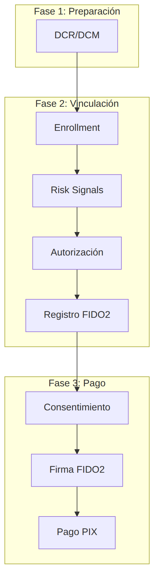

## Opus FIDO Server

El **Opus FIDO Server** es el componente de la **Plataforma Opus Open Finance** responsable de implementar las ceremonias **FIDO2/WebAuthn** — el estándar W3C de autenticación por credencial de clave pública — en el contexto de la **Jornada sin Redireccionamiento (JSR)** del *Open Finance Brasil*.

En el rol de **Institución Titular**, la institución utiliza el FIDO Server para registrar credenciales FIDO2 en el dispositivo del usuario (*attestation*) y, posteriormente, para validar las firmas generadas por esas credenciales en la autorización de pagos y transferencias (*assertion*). De esta forma, el usuario aprueba transacciones futuras usando únicamente la autenticación biométrica de su propio dispositivo, sin necesidad de rehacer el login en la Institución Titular en cada operación.

Esta sección presenta los flujos de negocio en los que participa el Opus FIDO Server, con el diagrama de secuencia de cada jornada y la descripción de la API en el estándar *Open API Specification*.

## Rol del FIDO Server en la arquitectura

El FIDO Server es un servicio de respaldo, consumido por el *backend* y el *Authorization Server* de la Institución Titular. No se expone directamente al Iniciador de Pago (ITP) ni al usuario final: la Institución Titular orquesta las llamadas al FIDO Server dentro de los endpoints regulatorios de *enrollment* y de autorización de consentimiento.

| Actor | Rol |
| :--- | :--- |
| **Usuario** | Titular de la cuenta; realiza el gesto de autenticación (biometría/PIN) en el dispositivo |
| **App / Backend ITP** | Iniciador de Transacción de Pago; conduce la jornada sin redireccionamiento |
| **Institución Titular** | Institución titular de la cuenta; orquesta *enrollment*, autorización y llamadas al FIDO Server |
| **Authorization Server de la Institución Titular** | Emite y valida tokens (FAPI) y dispara el aprovisionamiento de relying party |
| **Opus FIDO Server** | Ejecuta las ceremonias FIDO2 de *attestation* (registro) y *assertion* (autenticación) |

## Documentos de esta sección

### [DCR/DCM — Registro y Gestión de Cliente](dcrDcm.html)

Aprovisionamiento del relying party en el FIDO Server. Es la **precondición** para la integración: ejecutada fuera de la jornada de vinculación, siempre que ocurre un *Dynamic Client Registration/Management*.

### [Vinculación de Dispositivo/Cuenta](vinculacaoDeDispositivo.html)

Establecimiento del vínculo entre el dispositivo y la cuenta en la Institución Titular, incluyendo *enrollment* con señales de riesgo, jornada en la Institución Titular (FAPI *hybrid flow*) y la creación y registro de la credencial FIDO2 (*attestation*).

### [Pago sin Redireccionamiento](pagamentoSemRedirecionamento.html)

Ejecución de un pago PIX usando autenticación FIDO2 (*assertion*): iniciación del consentimiento, firma de la transacción con la credencial del dispositivo, autorización del consentimiento y liquidación.

## Visión General de los Flujos

Las tres jornadas se encadenan: el aprovisionamiento del relying party (DCR/DCM) habilita la integración, la vinculación registra la credencial FIDO2 en el dispositivo y, con el vínculo establecido, los pagos pasan a ser autorizados por firma FIDO2.

## Puntos Importantes

- La validación de `riskSignals` es responsabilidad **exclusiva de la Institución Titular**. El Opus FIDO Server es **agnóstico** en cuanto al contenido de las señales de riesgo.
- La validación del contenido del campo `rp` contra el *CN* del certificado **BRCAC** en los *payloads* OFB que involucran FIDO — conforme a la documentación del *Open Finance Brasil* — es responsabilidad de la Institución Titular.
- Se recomienda utilizar el `enrollmentId` como `username` en las operaciones con el Opus FIDO Server, para garantizar unicidad y facilitar el mapeo entre los sistemas.
- El campo `displayName` debe utilizarse para mostrar información amigable al usuario, a criterio de la Institución Titular.

## Especificación de la API

La API del Opus FIDO Server está descrita en el estándar *Open API Specification*: [`es-opusFidoServer-oas.yaml`](anexos/yml/es-opusFidoServer-oas.yaml). Consulte también la [API asociada][API-FidoServer] renderizada en Swagger UI.

[API-FidoServer]: ../../../../swagger-ui/index.html?api=es-oas-fido-server
