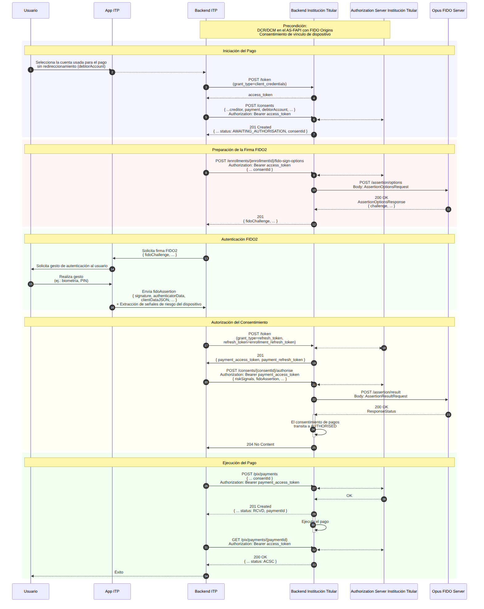

## Objetivo

El flujo de **Pago sin Redireccionamiento** ejecuta un pago PIX utilizando la credencial FIDO2 previamente registrada en el dispositivo para autenticar al usuario, siguiendo las especificaciones del *Open Finance Brasil* — **Jornada sin Redireccionamiento (JSR)**. El usuario aprueba la transacción directamente en la App del ITP, por biometría, sin ser redirigido al entorno de la Institución Titular.

En esta jornada, el Opus FIDO Server ejecuta la ceremonia de ***assertion*** (autenticación WebAuthn): genera el challenge de firma (`/assertion/options`) y valida la firma devuelta por el dispositivo (`/assertion/result`).

## Precondiciones

- **DCR/DCM** realizado en el *Authorization Server* con *FIDO Origins* (ver [DCR/DCM](dcrDcm.html));
- **Vínculo de dispositivo** ya establecido en el estado `AUTHORISED` (ver [Vinculación de Dispositivo/Cuenta](vinculacaoDeDispositivo.html));
- Credencial FIDO2 ya registrada en el dispositivo.

## Diagrama de Secuencia

## Etapas del Flujo

### 1. Iniciación del pago

1. El usuario selecciona, en la App del ITP, la cuenta usada para el pago sin redireccionamiento (`debtorAccount`).
2. El *backend* obtiene un token vía `POST /token` (`grant_type=client_credentials`).
3. El *backend* crea el consentimiento vía `POST /consents` (con `creditor`, `payment`, `debtorAccount`). La Institución Titular devuelve `201 Created` con el `consentId` en el estado **`AWAITING_AUTHORISATION`**.

### 2. Preparación de la firma FIDO2 (*assertion options*)

4. El *backend* solicita las opciones de firma vía `POST /enrollments/{enrollmentId}/fido-sign-options` (informando el `consentId`).
5. La Institución Titular llama al FIDO Server vía **`POST /assertion/options`** y devuelve el `fidoChallenge`.

### 3. Autenticación FIDO2

6. La App solicita el gesto de autenticación y el usuario realiza la biometría/PIN.
7. La App envía la `fidoAssertion` (`signature`, `authenticatorData`, `clientDataJSON`) al *backend*, junto con la extracción de señales de riesgo del dispositivo.

### 4. Autorización del consentimiento (*assertion result*)

8. El *backend* obtiene el token de pago vía `POST /token` (`grant_type=refresh_token`).
9. El *backend* autoriza el consentimiento vía `POST /consents/{consentId}/authorise` (con `riskSignals` y `fidoAssertion`).
10. La Institución Titular llama al FIDO Server vía **`POST /assertion/result`**. Con éxito, el consentimiento transita a **`AUTHORISED`**.

### 5. Ejecución del pago

11. El *backend* ejecuta el pago vía `POST /pix/payments` (con el `consentId`). La Institución Titular devuelve `201 Created` en el estado `RCVD`.
12. El *backend* consulta el pago vía `GET /pix/payments/{paymentId}` hasta el estado `ACSC` (liquidado) y devuelve éxito al usuario.

## Endpoints del FIDO Server

| Método | Endpoint | Descripción | Éxito |
| :----: | :------- | :---------- | :---: |
| POST | `/assertion/options` | Obtiene el challenge de autenticación (firma) FIDO2 | 200 |
| POST | `/assertion/result` | Envía la firma para validación | 200 |

### `AssertionOptionsRequest`

| Campo | Descripción |
| :--- | :--- |
| `username` | Identificador del usuario en la ceremonia. Se recomienda utilizar el `enrollmentId` |
| `userVerification` | Requisito de verificación del usuario (ej.: `required`) |
| `extensions` | Extensiones WebAuthn |

### `AssertionResultRequest`

| Campo | Descripción |
| :--- | :--- |
| `id` / `rawId` | Identificadores de la credencial utilizada |
| `response` | `authenticatorData`, `signature`, `userHandle` y `clientDataJSON` generados por el dispositivo |
| `type` | Tipo de la credencial (`public-key`) |
| `getClientExtensionResults` | Resultados de las extensiones del cliente |

> **Importante:** La validación de `riskSignals` es responsabilidad exclusiva de la Institución Titular — el Opus FIDO Server es agnóstico en cuanto al contenido de las señales de riesgo.

## Referencias

- Especificación OpenAPI: [`es-opusFidoServer-oas.yaml`](anexos/yml/es-opusFidoServer-oas.yaml) (ver también la [API asociada][API-FidoServer])
- [W3C WebAuthn-2 — getAssertion](https://www.w3.org/TR/webauthn-2/#sctn-getAssertion)
- [Vínculo de Dispositivo (perspectiva ITP)](../iniciacaoDePagamentosERecepcaoDeDados/funcionamento/vinculoDeDispositivo.html)

[API-FidoServer]: ../../../../swagger-ui/index.html?api=es-oas-fido-server
