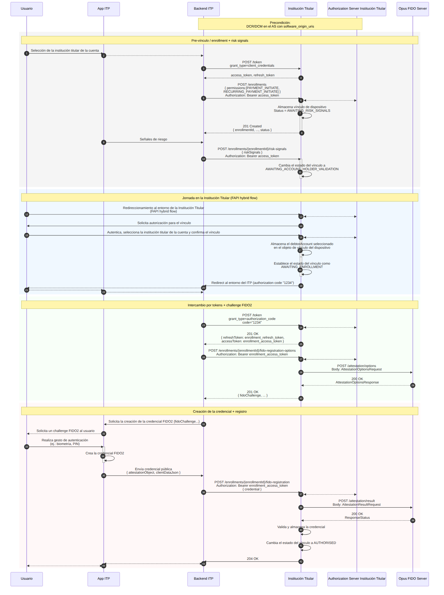

## Objetivo

La **Vinculación de Dispositivo/Cuenta** (*enrollment*) establece el vínculo entre el dispositivo del usuario y su cuenta en la Institución Titular, siguiendo las especificaciones del *Open Finance Brasil* — **Jornada sin Redireccionamiento (JSR)**. Al final del flujo, una **credencial FIDO2** queda registrada en el dispositivo y apta para autorizar pagos futuros por biometría, sin nuevos redireccionamientos a la Institución Titular.

En esta jornada, el Opus FIDO Server ejecuta la ceremonia de ***attestation*** (registro de la credencial WebAuthn): genera las opciones de creación de la credencial (`/attestation/options`) y valida el resultado devuelto por el dispositivo (`/attestation/result`).

## Precondiciones

- **DCR/DCM** realizado en el *Authorization Server* con `software_origin_uris` (ver [DCR/DCM](dcrDcm.html));
- ITP con capacidades FIDO2.

## Diagrama de Secuencia

## Etapas del Flujo

### 1. Pre-vínculo — *enrollment* + señales de riesgo

1. El usuario selecciona la Institución Titular de la cuenta en la App del ITP.
2. El *backend* del ITP obtiene un token vía `POST /token` (`grant_type=client_credentials`).
3. El *backend* crea el vínculo vía `POST /enrollments` (con `permissions`, ej.: `PAYMENT_INITIATE`, `RECURRING_PAYMENT_INITIATE`). La Institución Titular almacena el vínculo con estado **`AWAITING_RISK_SIGNALS`** y devuelve `201 Created` con el `enrollmentId`.
4. El *backend* envía las señales de riesgo vía `POST /enrollments/{enrollmentId}/risk-signals`. La Institución Titular cambia el estado a **`AWAITING_ACCOUNT_HOLDER_VALIDATION`**.

### 2. Jornada en la Institución Titular (FAPI *hybrid flow*)

5. El usuario es redirigido al entorno de la Institución Titular y autentica, selecciona la institución titular de la cuenta y confirma el vínculo.
6. La Institución Titular almacena el `debtorAccount` seleccionado en el objeto de vínculo, establece el estado como **`AWAITING_ENROLLMENT`** y redirige de vuelta al entorno del ITP con el *authorization code*.

### 3. Intercambio por tokens + challenge FIDO2 (*attestation*)

7. El *backend* intercambia el code por tokens vía `POST /token` (`grant_type=authorization_code`), recibiendo `enrollment_access_token` y `enrollment_refresh_token`.
8. El *backend* solicita las opciones de registro vía `POST /enrollments/{enrollmentId}/fido-registration-options`.
9. La Institución Titular llama al FIDO Server vía **`POST /attestation/options`** y devuelve el `fidoChallenge` al *backend* (compatible con [W3C WebAuthn-2][webauthn-makecred]).

### 4. Creación de la credencial + registro (*attestation result*)

10. La App solicita el gesto de autenticación (biometría/PIN) al usuario y **crea la credencial FIDO2** en el dispositivo.
11. La App envía la credencial pública (`attestationObject`, `clientDataJson`) al *backend*, que la reenvía vía `POST /enrollments/{enrollmentId}/fido-registration`.
12. La Institución Titular llama al FIDO Server vía **`POST /attestation/result`**. Con éxito, valida y almacena la credencial y cambia el estado del vínculo a **`AUTHORISED`**.

## Endpoints del FIDO Server

| Método | Endpoint | Descripción | Éxito |
| :----: | :------- | :---------- | :---: |
| POST | `/attestation/options` | Obtiene las opciones de registro (creación) de la credencial FIDO2 | 200 |
| POST | `/attestation/result` | Envía el resultado del registro para validación y almacenamiento | 200 |

### `AttestationOptionsRequest`

| Campo | Descripción |
| :--- | :--- |
| `username` | Identificador del usuario en la ceremonia. Se recomienda utilizar el `enrollmentId` |
| `displayName` | Nombre amigable mostrado al usuario, a criterio de la Institución Titular |
| `authenticatorSelection` | Criterios de selección del autenticador (`authenticatorAttachment`, `userVerification`, `residentKey`, `requireResidentKey`) |
| `attestation` | Preferencia de *attestation conveyance* |
| `extensions` | Extensiones WebAuthn |

### `AttestationResultRequest`

| Campo | Descripción |
| :--- | :--- |
| `id` / `rawId` | Identificadores de la credencial creada |
| `response` | `clientDataJSON` + `attestationObject` generados por el dispositivo |
| `type` | Tipo de la credencial (`public-key`) |
| `authenticatorAttachment` | Forma de acoplamiento del autenticador (`platform`/`cross-platform`) |
| `getClientExtensionResults` | Resultados de las extensiones del cliente |

## Máquina de estados del vínculo

| Status | Cómo se llega | Próximo paso |
| :----- | :------------ | :----------- |
| `AWAITING_RISK_SIGNALS` | `POST /enrollments` devuelve 201 | Enviar `/risk-signals` |
| `AWAITING_ACCOUNT_HOLDER_VALIDATION` | Después de que `/risk-signals` sea aceptado | Redirect del usuario a la Institución Titular |
| `AWAITING_ENROLLMENT` | El usuario aprueba en la Institución Titular (OIDC OK) | Registrar la credencial FIDO2 |
| `AUTHORISED` | Credencial FIDO2 registrada con éxito | Vínculo apto para autorizar pagos |

> **Importante:** La validación de `riskSignals` es responsabilidad exclusiva de la Institución Titular — el Opus FIDO Server es agnóstico en cuanto al contenido de las señales de riesgo.

## Referencias

- Especificación OpenAPI: [`es-opusFidoServer-oas.yaml`](anexos/yml/es-opusFidoServer-oas.yaml) (ver también la [API asociada][API-FidoServer])
- [SV Vínculo de Dispositivo — Open Finance Brasil](https://openfinancebrasil.atlassian.net/wiki/spaces/OF/pages/1436516353/v2.2.0+-+SV+V+nculo+de+dispositivo)
- [W3C WebAuthn-2 — makeCredentialOptions][webauthn-makecred]

[API-FidoServer]: ../../../../swagger-ui/index.html?api=es-oas-fido-server
[webauthn-makecred]: https://www.w3.org/TR/webauthn-2/#dictionary-makecredentialoptions
