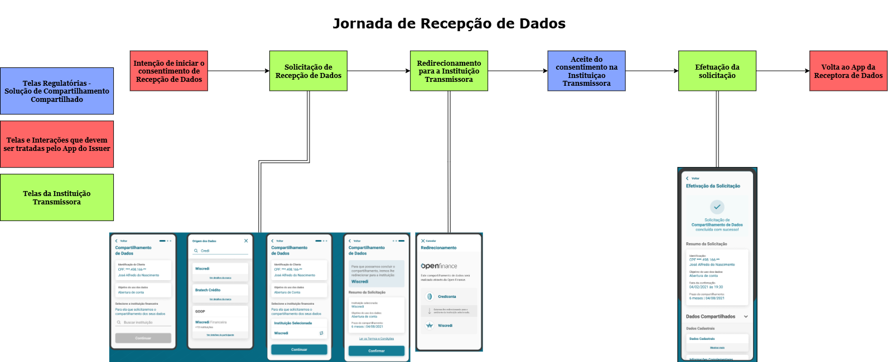

## Consentimento Compartilhado

A solução de **consentimento compartilhado** no contexto do Open Finance refere-se a uma solução centralizada que permite às instituições financeiras gerenciarem de forma integrada os consentimentos dos usuários para compartilhamento de dados, pagamentos e vínculos de contas entre diferentes participantes do ecossistema. Ela simplifica o processo ao centralizar as etapas de exibição, confirmação e cancelamento de consentimentos, garantindo conformidade regulatória e facilitando a experiência do usuário, enquanto diferentes partes do sistema mantêm suas responsabilidades específicas no ciclo de vida do consentimento.

Nossa solução foi desenvolvida para facilitar a adesão ao Open Finance Brasil, atendendo às exigências regulatórias de forma eficiente. Aqui, você encontrará guias que explicam, de maneira simples, os benefícios de usar nossa solução e o que é necessário ser desenvolvido por sua equipe.

---

## Benefícios de usar nossa solução

1. **Facilidade de Implementação:**
Nossa solução atende a todas as exigências regulatórias, poupando tempo e esforço da sua equipe de desenvolvimento. Com os principais processos de exibição, confirmação e gestão de consentimentos já implementados, tudo está pronto para uso imediato.

2. **Conformidade Regulamentar:**
Estamos em total conformidade com as diretrizes do Open Finance Brasil, assegurando que você adote as melhores práticas na gestão de consentimentos.

3. **Experiência do Usuário:**
Oferecemos uma interface intuitiva que permite aos clientes visualizar e gerenciar seus consentimentos diretamente na plataforma, facilitando a navegação e garantindo o cumprimento das exigências regulatórias.
