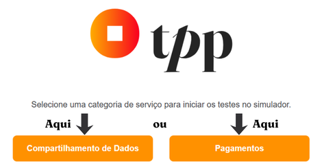
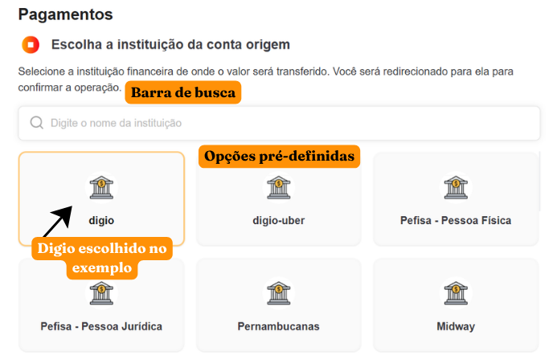
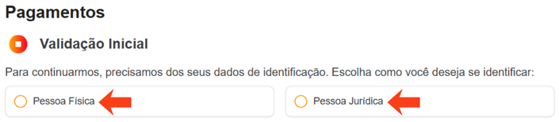
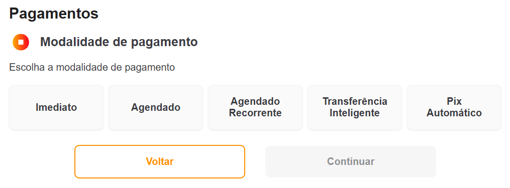
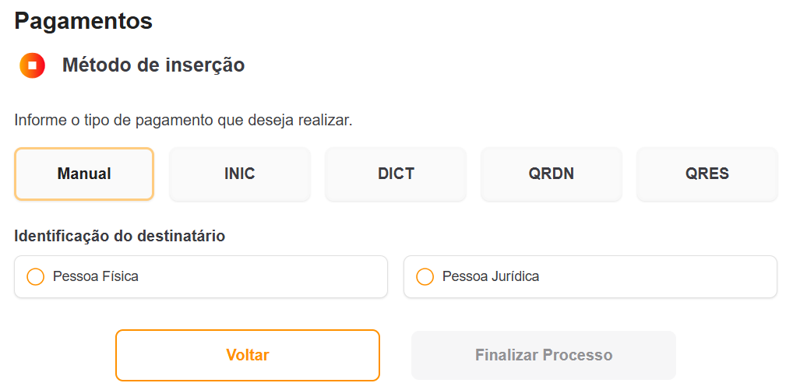
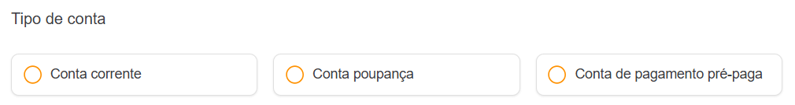
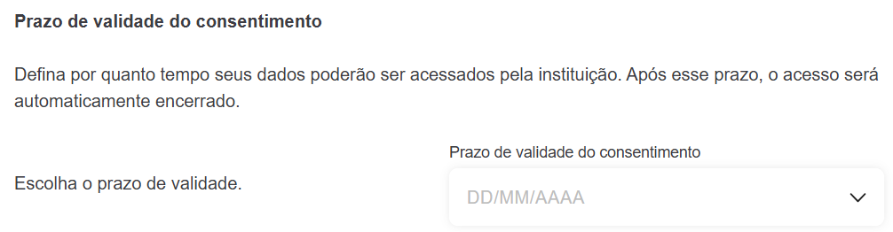
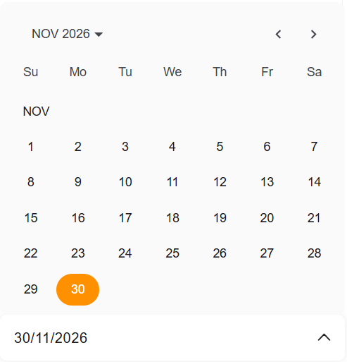

## Introdução

Este guia fornece explicações acerca da ferramenta **OpusTPP Demo** e instruções detalhadas para:

- Navegar pela interface intuitiva da ferramenta;
- Preencher campos obrigatórios com precisão;
- Validar transações com segurança;
- Solucionar erros comuns.

Ao seguir as orientações apresentadas, você poderá aproveitar todas as funcionalidades do **OpusTPP Demo** de maneira simples e eficaz.

## O que é o OpusTPP Demo?

O Opus TPP Demo é uma plataforma avançada desenvolvida para simplificar a **simulação** e **execução** de operações no ecossistema de Open Finance, abrangendo:

- Pagamentos instantâneos:
  - Pagamentos imediatos;
  - Pagamentos agendados;
  - Pagamentos agendados recorrentes;
  - Transferências inteligentes;
  - Pix Automático.
- Compartilhamento de dados (consentimento de informações financeiras).

## Termos e Definições

Antes de iniciarmos as instruções para o uso, aqui vai uma explicação de termos técnicos ou específicos utilizados no site:

- **DICT:** Documento de Iniciação de Cobrança via PIX (padrão BACEN).
- **QRDN/QRES:** QR Code Dinâmico (QRDN) ou Estático (QRES) para pagamentos via PIX.
- **INIC:** Iniciação de Pagamento por meio de códigos específicos.
- **Consentimento:** Autorização formal para compartilhamento de dados entre instituições.

## Instruções

O primeiro passo é selecionar qual categoria de serviço deseja testar. Escolha entre **Pagamentos** e **Compartilhamento de Dados**.

### **Pagamentos**

#### 1. Conta de origem

Nesta etapa, você deve selecionar a instituição financeira de onde o valor deve ser transferido. Você pode escolher entre uma instituição diretamente na listagem ou pode optar por buscar a instituição que deseja, através da barra de pesquisa que se encontra logo no início da página:

>**EXEMPLO:**
>Digite "Digio" para filtrar.

#### 2. Validação inicial

Aqui você deve escolher como será identificado:

- Pessoa Física;
- Pessoa Jurídica.

Caso opte por Pessoa Física, você deve informar o CPF do pagamento, caso opte por Pessoa Jurídica, deve adicionar também o CNPJ.
Após o preenchimento correto dos campos obrigatórios, você poderá prosseguir para a próxima etapa.

#### 3. Modalidade de pagamento

Aqui, realize a seleção da modalidade do pagamento a ser realizado. A escolha pode ser feita entre:

- Imediato;
- Agendado;
- Agendado recorrente;
- Transferência inteligente;
- Pix automático.

| Modalidade | Campos Adicionais |
| :--------: | :---------------: |
| **Agendado Recorrente** | Data final e intervalo de repetição |
| **Transferência Inteligente** | Frequência (diária/semanal/mensal/anual), prazo de validade (horas/dias) |
| **Pix Automático** | Frequência (semanal/mensal/trimestral/semestral/anual), prazo de validade |

>**OBSERVAÇÃO:**
>Campos dinâmicos serão exibidos conforme a modalidade escolhida.

#### 4. Método de Inserção

Aqui você deve selecionar entre as cinco opções dispostas, como os dados do recebedor do pagamento serão inseridos, para Pessoa Física ou Jurídica.

Preencha os campos editáveis de cada método (os cinco) e selecione quase ao fim da página o tipo de conta do recebedor:

- **INIC e DICT:** Após o preenchimento, por fim, insira a chave pix do recebedor.
- **QRDN:** Após o preenchimento, por fim, insira a chave pix do recebedor e o código do QR Code Dinâmico.
- **QRES:** Após o preenchimento, por fim, insira a chave pix do recebedor e o código do QR Code Estático.

#### 5. Redirecionamento para o banco

Aguarde o redirecionamento, ao ser redirecionado autentique-se no banco de origem e aceite o consentimento de pagamento criado no OpusTPP Demo. Ao receber a confirmação do banco emissor terá chegado ao fim do processo!  

>**TEMPO MÉDIO:**
>Cerca de 5-15 segundos para PIX.

### **Compartilhamento de Dados**

#### 1. Conta de origem - Compartilhamento de Dados

Nesta etapa, você deve selecionar a instituição financeira de onde o valor deve ser transferido. Você pode escolher entre uma instituição diretamente na listagem ou pode optar por buscar a instituição que deseja, através da barra de pesquisa que se encontra logo no início da página:

>**EXEMPLO:**
>Digite "Digio" para filtrar.

#### 2. Validação inicial - Compartilhamento de Dados

Aqui você deve escolher como será identificado:

- Pessoa Física;
- Pessoa Jurídica.

Caso opte por Pessoa Física, você deve informar o CPF do pagamento, caso opte por Pessoa Jurídica, deve adicionar também o CNPJ.
Após o preenchimento correto dos campos obrigatórios, você poderá prosseguir para a próxima etapa.

#### 3. Seleção de dados

Nesta etapa, por padrão, todas as opções se encontrarão **selecionadas**, o que significa que todos os dados presentes serão compartilhados.

Os tipos de dados para consentimento presentes na página são:

- **Dados cadastrais;**
- **Cartão de crédito;**
- **Contas;**
- **Empréstimos;**
- **Financiamentos;**
- **Adiantamento a depositantes;**
- **Direitos creditórios descontados;**
- **Renda fixa bancária;**
- **Renda fixa crédito;**
- **Renda variável;**
- **Título do tesouro direto;**
- **Fundo de investimento;**
- **Câmbio;**
- **Recursos.**

Ao final da lista é possível definir o prazo de validade do consentimento dos dados selecionados. Esse prazo define por quanto tempo seus dados poderão ser acessados pela instituição. A definição do prazo é feita através de uma caixa de seleção como mostra na imagem:

Ao clicar na caixa de seleção um calendário será aberto:

Ao escolher o prazo desejado, prossiga para a próxima etapa.

>**OBSERVAÇÃO:**
>Se nenhuma data for selecionada o prazo será considerado **Indeterminado**.

#### 4. Revisão de dados

Esta é a etapa onde é possível revisar os dados que serão compartilhados com segurança com a sua instituição. Você pode visualizar os dados escolhidos e preenchidos, de forma resumida, por meio de uma lista que estará em sua tela.

Caso tenha interesse em editar alguma informação, basta voltar, realizar a edição e depois realizar o procedimento de retorno à esta tela.

Se optar por continuar, você autorizará o compartilhamento dos dados escolhidos e revisados, por meio deste botão:

Após o a autorização você será redirecionado, e após isso, deve se autenticar no banco de origem e aceitar o consentimento de pagamento criado no OpusTPP Demo.

**E fim! O compartilhamento foi autorizado e realizado.**
