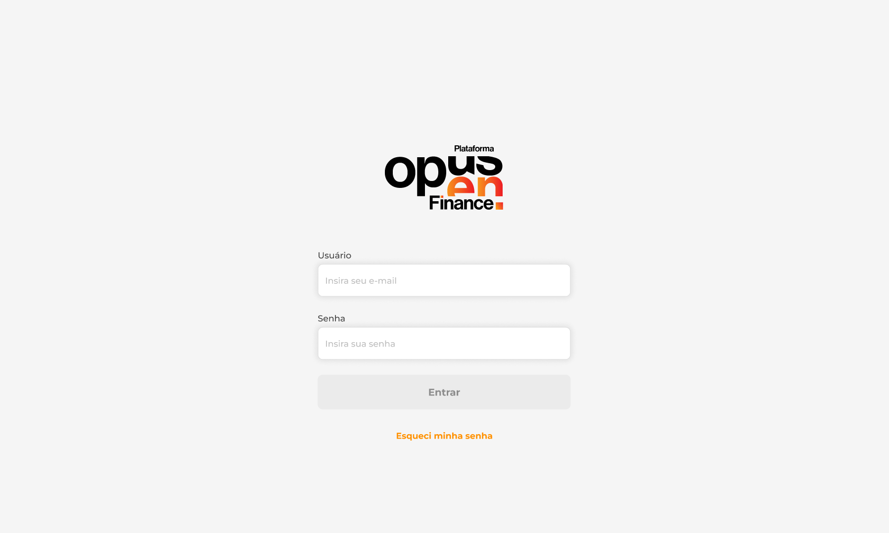
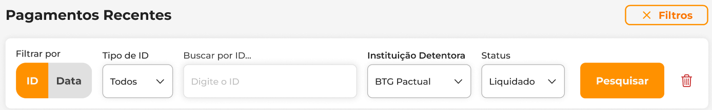
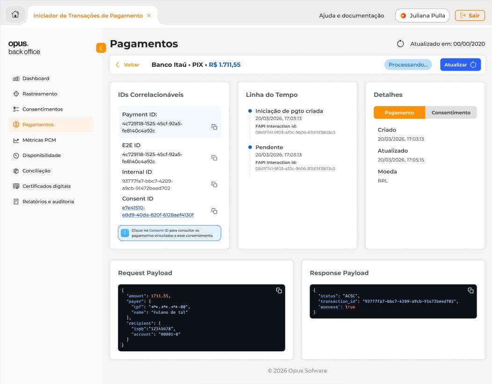
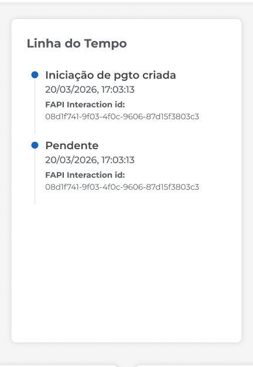
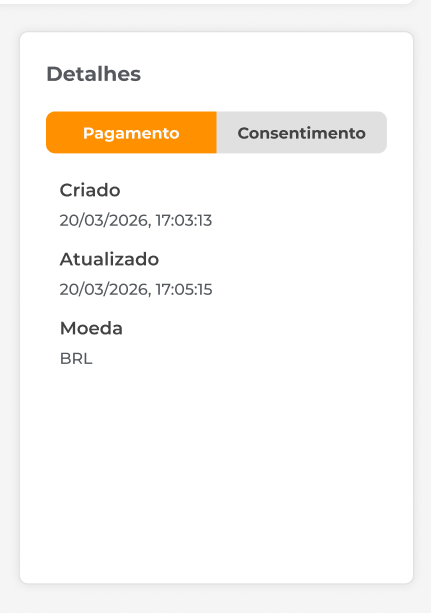
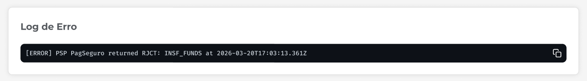

## Introdução

O Portal de Backoffice tem como objetivo permitir a **visualização, consulta e rastreabilidade de pagamentos**, oferecendo informações detalhadas sobre cada transação, seu status e dados relacionados e garantindo visibilidade completa do fluxo, desde a criação até a liquidação ou falha.

Esta documentação descreve as funcionalidades disponíveis nas telas do sistema, bem como o comportamento esperado de cada campo e ação, auxiliando no uso e no desenvolvimento da aplicação.

---

<!--## Links Úteis

- **Máquina de Estados do Pagamento (OOF):** *(inserir link)*

---
-->

## Tela 01 – Login

### **Descrição - Login**

Tela inicial do sistema, responsável pela autenticação do usuário.

### **Campos**

- **Usuário;**
- **Senha.**

### **Regras e Comportamento**

- Após autenticação bem-sucedida, o usuário deve ser redirecionado automaticamente para a **Tela 02 – Listagem de Pagamentos**.
- O método de autenticação ainda está em definição.
- Não é recomendado utilizar credenciais fixas definidas manualmente devido a riscos de segurança.

---

## Tela 02 – Listagem de Pagamentos

### Descrição

Exibe todos os pagamentos registrados no sistema, permitindo busca e filtragem.

### Campos da Listagem

- **Payment ID:** Identificador único do pagamento;
- **E2E ID:** Identificador do fluxo Pix;
- **Status:** Estado atual do pagamento;
- **Instituição Detentora:** Banco responsável pelo pagamento;
- **Valor:** Valor monetário;
- **Criado em:** Data/hora de criação;
- **Data de Liquidação:** Data prevista ou realizada da liquidação.

### Status Possíveis

Para informações mais detalhadas, acesse [este link](https://openfinancebrasil.atlassian.net/wiki/spaces/OF/pages/1600030369/M+quina+de+Estados+-+v5.0.0-rc.1+-+SV+Pagamentos).

| Nome "Natural"              | Código |
| :-------------------------: | :----: |
| Requisição recebida         | RCVD   |
| Cancelado pelo usuário      | CANC   |
| PIX pronto                  | ACCP   |
| PIX enviado para liquidação | ACPD   |
| PIX rejeitado               | RJCT   |
| PIX liquidado               | ACSC   |
| PIX pendente                | PDNG   |
| PIX agendado                | SCHD   |

### Filtros da listagem

#### Campos Fixos

- Instituição Detentora;
- Status.

#### Filtro por ID

- Tipo de ID:
  - Payment ID;
  - E2E ID;
  - Internal ID;
  - Consent ID;
- Campo de busca livre.

#### Filtro por Data

- Data inicial (De);
- Data final (Até).

### Regras

- Ao aplicar filtros, o botão deve exibir um **“X”** para limpar a seleção.
- Sem pagamentos cadastrados:

  > “Nenhum pagamento encontrado. Inicie um novo pagamento para visualizá-lo.”
- Sem resultados no filtro:

  > “Nenhum pagamento corresponde aos filtros selecionados. Ajuste os filtros e tente novamente.”
- Apenas o menu **“Pagamentos”** deve estar disponível na barra lateral.
- Ao selecionar um pagamento, o usuário é redirecionado para a **Tela 03 – Detalhes do Pagamento**.

---

## Tela 03 – Detalhe de um Pagamento

### Descrição da tela

Apresenta todas as informações detalhadas de um pagamento específico.

### Seções da tela de detalhes

---

### Cabeçalho

### Campos

- Instituição Detentora;
- Tipo: PIX (fixo);
- Valor (com cor baseada no status);
- Status;
- Atualizado em.

### Ações

- **Voltar:** Retorna à listagem mantendo filtros;
- **Atualizar:** Consulta o status mais recente na instituição.

---

### IDs Correlacionáveis

### Campos de IDs

- Payment ID;
- E2E ID;
- Internal ID;
- Consent ID.

### Ações da página

- **Copiar:** Copia o valor para a área de transferência;
- **Selecionar Consent ID:** Redireciona para listagem filtrada.

### Mensagem

> “Clique no Consent ID para consultar os pagamentos vinculados a esse consentimento.”

---

### Timeline (Linha do Tempo)

### Campos do Timeline

Cada evento contém:

- Status (título);
- Data e hora;
- FAPI Interaction ID.

### Regras do Timeline

- Exibir apenas os eventos informados pela instituição detentora;
- A quantidade de eventos pode variar.

---

### Detalhes

### Pagamento

- Criado (data/hora);
- Atualizado (data/hora);
- Moeda.

### Regra

- Caso não haja atualização, repetir a data de criação.

---

### Consentimento

### Exemplos de Campos (PIX)

- Data do consentimento;
- Identificador;
- Destinatário;
- CPF/CNPJ;
- Solicitante;
- Devedor.

### Regras do campo

- Os dados são apenas para visualização;
- **Não é permitido editar nenhum campo.**

---

### Request Payload

### Descrição do Request

Exibe o payload enviado pela instituição cliente.

### Regra do Request

Caso não exista:

> “Request Payload não disponível para este pagamento.”

---

### Response Payload

### Descrição do Response

Exibe o payload retornado pelo sistema.

### Regra do Response

Caso não exista:

> “Response Payload não disponível para este pagamento.”

---

### Log de Erro

### Descrição do Log de Erro

Mostra o motivo da falha no pagamento.

### Exibição Condicional

Apenas para status:

- `CANC`;
- `RJCT.`

### Regra do Log de Erro

Caso não exista:

> “Log de erro não disponível para este pagamento.”
