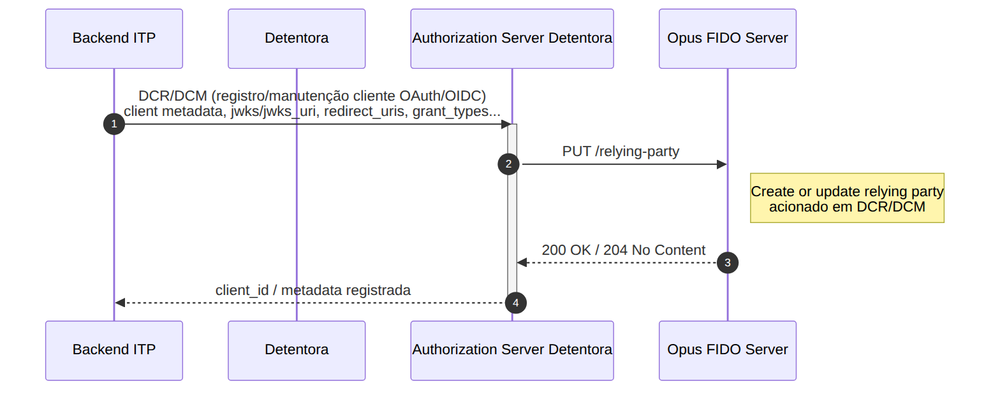

## Objetivo

O **DCR/DCM** (*Dynamic Client Registration / Dynamic Client Management*) é o processo de registro e manutenção do cliente confidencial OAuth/OIDC no *Authorization Server* da Detentora. No contexto do Opus FIDO Server, esse processo funciona como **gatilho de provisionamento da *relying party* (RP)**: sempre que um cliente é registrado ou atualizado, o *Authorization Server* aciona o FIDO Server para criar ou atualizar a configuração de RP (identificador, nome e origens permitidas) que será utilizada nas cerimônias de *attestation* e *assertion*.

Este fluxo é executado **fora da jornada de vínculo** e é **pré-condição** para todos os demais fluxos desta seção.

## Pré-condições

- *Authorization Server* da Detentora configurado;
- *Backend* do ITP preparado para a integração (client OAuth/OIDC com `jwks`/`jwks_uri`, `redirect_uris`, `grant_types` etc.).

## Diagrama de Sequência

## Etapas do Fluxo

1. **Registro/manutenção do cliente:** o *Backend* do ITP realiza o DCR/DCM junto ao *Authorization Server* da Detentora, enviando os metadados do cliente (`jwks`/`jwks_uri`, `redirect_uris`, `grant_types` etc.).
2. **Provisionamento da RP:** o *Authorization Server* aciona o FIDO Server via `PUT /relying-party`, criando ou atualizando a *relying party* correspondente.
3. **Confirmação:** o FIDO Server responde `200 OK` ou `204 No Content`, e o *Authorization Server* devolve ao ITP o `client_id` e os metadados registrados.

## Endpoint do FIDO Server

| Método | Endpoint | Descrição | Sucesso |
| :----: | :------- | :-------- | :-----: |
| PUT | `/relying-party` | Cria ou atualiza a *relying party* (acionado em DCR/DCM) | 200 / 204 |

### Corpo da requisição (`RelyingPartyRequest`)

| Campo | Descrição |
| :--- | :--- |
| `relyingPartyId` | Identificador da *relying party* (rpId) — normalmente o domínio associado ao cliente |
| `relyingPartyName` | Nome amigável da *relying party* |
| `relyingPartyOrigins` | Lista de origens permitidas (*origins*) para as cerimônias WebAuthn |
| `brandId` | Identificador da marca associada à *relying party* |

> **Importante:** A validação do conteúdo do campo `rp`/`relyingPartyId` contra o *CN* do certificado **BRCAC**, conforme a documentação do *Open Finance Brasil*, é responsabilidade da Detentora.

## Referências

- Especificação OpenAPI: [`opusFidoServer-oas.yaml`](anexos/yml/opusFidoServer-oas.yaml) (ver também [API associada][API-FidoServer])
- [W3C WebAuthn-2 — Relying Party](https://www.w3.org/TR/webauthn-2/#relying-party)

[API-FidoServer]: ../../../../swagger-ui/index.html?api=oas-fido-server
