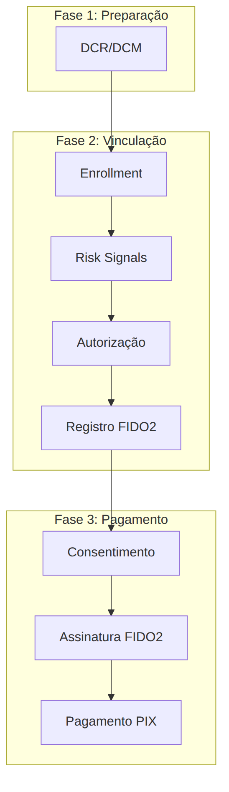

## Opus FIDO Server

O **Opus FIDO Server** é o componente da **Plataforma Opus Open Finance** responsável por implementar as cerimônias **FIDO2/WebAuthn** — o padrão W3C de autenticação por credencial de chave pública — no contexto da **Jornada sem Redirecionamento (JSR)** do *Open Finance Brasil*.

No papel de **Detentora de Conta**, a instituição utiliza o FIDO Server para registrar credenciais FIDO2 no dispositivo do usuário (*attestation*) e, posteriormente, para validar as assinaturas geradas por essas credenciais na autorização de pagamentos e transferências (*assertion*). Dessa forma, o usuário aprova transações futuras usando apenas a autenticação biométrica do próprio dispositivo, sem precisar refazer login na Detentora a cada operação.

Esta seção apresenta os fluxos de negócio em que o Opus FIDO Server participa, com os diagramas de sequência de cada jornada e a descrição da API no padrão *Open API Specification*.

## Papel do FIDO Server na arquitetura

O FIDO Server é um serviço de retaguarda, consumido pelo *backend* e pelo *Authorization Server* da Detentora. Ele não é exposto diretamente ao Iniciador de Pagamento (ITP) nem ao usuário final: a Detentora orquestra as chamadas ao FIDO Server dentro dos endpoints regulatórios de *enrollment* e de autorização de consentimento.

| Ator | Papel |
| :--- | :--- |
| **Usuário** | Titular da conta; realiza o gesto de autenticação (biometria/PIN) no dispositivo |
| **App / Backend ITP** | Iniciador de Transação de Pagamento; conduz a jornada sem redirecionamento |
| **Detentora** | Instituição detentora da conta; orquestra *enrollment*, autorização e chamadas ao FIDO Server |
| **Authorization Server da Detentora** | Emite e valida *tokens* (FAPI) e dispara o provisionamento de *relying party* |
| **Opus FIDO Server** | Executa as cerimônias FIDO2 de *attestation* (registro) e *assertion* (autenticação) |

## Documentos desta seção

### [DCR/DCM — Registro e Manutenção de Cliente](dcrDcm.html)

Provisionamento da *relying party* no FIDO Server. É a **pré-condição** para a integração: executada fora da jornada de vínculo, sempre que ocorre um *Dynamic Client Registration/Management*.

### [Vinculação de Dispositivo/Conta](vinculacaoDeDispositivo.html)

Estabelecimento do vínculo entre o dispositivo e a conta na Detentora, incluindo *enrollment* com sinais de risco, jornada na Detentora (FAPI *hybrid flow*) e a criação e registro da credencial FIDO2 (*attestation*).

### [Pagamento sem Redirecionamento](pagamentoSemRedirecionamento.html)

Execução de um pagamento PIX usando autenticação FIDO2 (*assertion*): iniciação do consentimento, assinatura da transação com a credencial do dispositivo, autorização do consentimento e liquidação.

## Visão Geral dos Fluxos

As três jornadas se encadeiam: o provisionamento da *relying party* (DCR/DCM) habilita a integração, a vinculação registra a credencial FIDO2 no dispositivo e, com o vínculo estabelecido, os pagamentos passam a ser autorizados por assinatura FIDO2.

## Pontos Importantes

- A validação de `riskSignals` é responsabilidade **exclusiva da Detentora**. O Opus FIDO Server é **agnóstico** quanto ao conteúdo dos sinais de risco.
- A validação do conteúdo do campo `rp` contra o *CN* do certificado **BRCAC** nos *payloads* OFB que envolvem FIDO — conforme documentação do *Open Finance Brasil* — é responsabilidade da Detentora.
- Recomenda-se utilizar o `enrollmentId` como `username` nas operações com o Opus FIDO Server, para garantir unicidade e facilitar o mapeamento entre os sistemas.
- O campo `displayName` deve ser utilizado para exibir informações amigáveis ao usuário, a critério da Detentora.

## Especificação da API

A API do Opus FIDO Server está descrita no padrão *Open API Specification*: [`opusFidoServer-oas.yaml`](anexos/yml/opusFidoServer-oas.yaml). Consulte também a [API associada][API-FidoServer] renderizada no Swagger UI.

[API-FidoServer]: ../../../../swagger-ui/index.html?api=oas-fido-server
