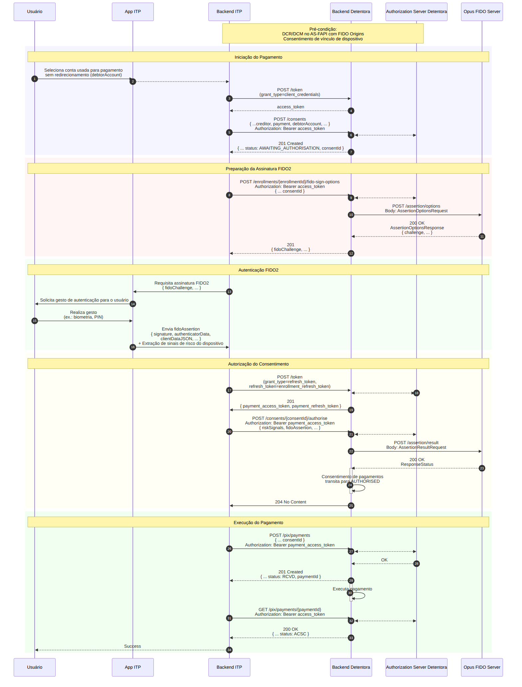

## Objetivo

O fluxo de **Pagamento sem Redirecionamento** executa um pagamento PIX utilizando a credencial FIDO2 previamente registrada no dispositivo para autenticar o usuário, seguindo as especificações do *Open Finance Brasil* — **Jornada sem Redirecionamento (JSR)**. O usuário aprova a transação diretamente no App do ITP, por biometria, sem ser redirecionado ao ambiente da Detentora.

Nesta jornada, o Opus FIDO Server executa a cerimônia de ***assertion*** (autenticação WebAuthn): gera o *challenge* de assinatura (`/assertion/options`) e valida a assinatura devolvida pelo dispositivo (`/assertion/result`).

## Pré-condições

- **DCR/DCM** realizado no *Authorization Server* com *FIDO Origins* (ver [DCR/DCM](dcrDcm.html));
- **Vínculo de dispositivo** já estabelecido no status `AUTHORISED` (ver [Vinculação de Dispositivo/Conta](vinculacaoDeDispositivo.html));
- Credencial FIDO2 já registrada no dispositivo.

## Diagrama de Sequência

## Etapas do Fluxo

### 1. Iniciação do pagamento

1. O usuário seleciona, no App do ITP, a conta usada para o pagamento sem redirecionamento (`debtorAccount`).
2. O *Backend* obtém um *token* via `POST /token` (`grant_type=client_credentials`).
3. O *Backend* cria o consentimento via `POST /consents` (com `creditor`, `payment`, `debtorAccount`). A Detentora retorna `201 Created` com o `consentId` no status **`AWAITING_AUTHORISATION`**.

### 2. Preparação da assinatura FIDO2 (*assertion options*)

4. O *Backend* solicita as opções de assinatura via `POST /enrollments/{enrollmentId}/fido-sign-options` (informando o `consentId`).
5. A Detentora aciona o FIDO Server via **`POST /assertion/options`** e devolve o `fidoChallenge`.

### 3. Autenticação FIDO2

6. O App requisita o gesto de autenticação e o usuário realiza a biometria/PIN.
7. O App envia a `fidoAssertion` (`signature`, `authenticatorData`, `clientDataJSON`) ao *Backend*, junto com a extração de sinais de risco do dispositivo.

### 4. Autorização do consentimento (*assertion result*)

8. O *Backend* obtém o *token* de pagamento via `POST /token` (`grant_type=refresh_token`).
9. O *Backend* autoriza o consentimento via `POST /consents/{consentId}/authorise` (com `riskSignals` e `fidoAssertion`).
10. A Detentora aciona o FIDO Server via **`POST /assertion/result`**. Com sucesso, o consentimento transita para **`AUTHORISED`**.

### 5. Execução do pagamento

11. O *Backend* executa o pagamento via `POST /pix/payments` (com o `consentId`). A Detentora retorna `201 Created` no status `RCVD`.
12. O *Backend* consulta o pagamento via `GET /pix/payments/{paymentId}` até o status `ACSC` (liquidado) e retorna sucesso ao usuário.

## Endpoints do FIDO Server

| Método | Endpoint | Descrição | Sucesso |
| :----: | :------- | :-------- | :-----: |
| POST | `/assertion/options` | Obtém o *challenge* de autenticação (assinatura) FIDO2 | 200 |
| POST | `/assertion/result` | Submete a assinatura para validação | 200 |

### `AssertionOptionsRequest`

| Campo | Descrição |
| :--- | :--- |
| `username` | Identificador do usuário na cerimônia. Recomenda-se utilizar o `enrollmentId` |
| `userVerification` | Requisito de verificação do usuário (ex.: `required`) |
| `extensions` | Extensões WebAuthn |

### `AssertionResultRequest`

| Campo | Descrição |
| :--- | :--- |
| `id` / `rawId` | Identificadores da credencial utilizada |
| `response` | `authenticatorData`, `signature`, `userHandle` e `clientDataJSON` gerados pelo dispositivo |
| `type` | Tipo da credencial (`public-key`) |
| `getClientExtensionResults` | Resultados das extensões do cliente |

> **Importante:** A validação de `riskSignals` é responsabilidade exclusiva da Detentora — o Opus FIDO Server é agnóstico quanto ao conteúdo dos sinais de risco.

## Referências

- Especificação OpenAPI: [`opusFidoServer-oas.yaml`](anexos/yml/opusFidoServer-oas.yaml) (ver também [API associada][API-FidoServer])
- [W3C WebAuthn-2 — getAssertion](https://www.w3.org/TR/webauthn-2/#sctn-getAssertion)
- [Pagamento sem Redirecionamento — Vínculo de Dispositivo (visão ITP)](../iniciacaoDePagamentosERecepcaoDeDados/funcionamento/vinculoDeDispositivo.html)

[API-FidoServer]: ../../../../swagger-ui/index.html?api=oas-fido-server
