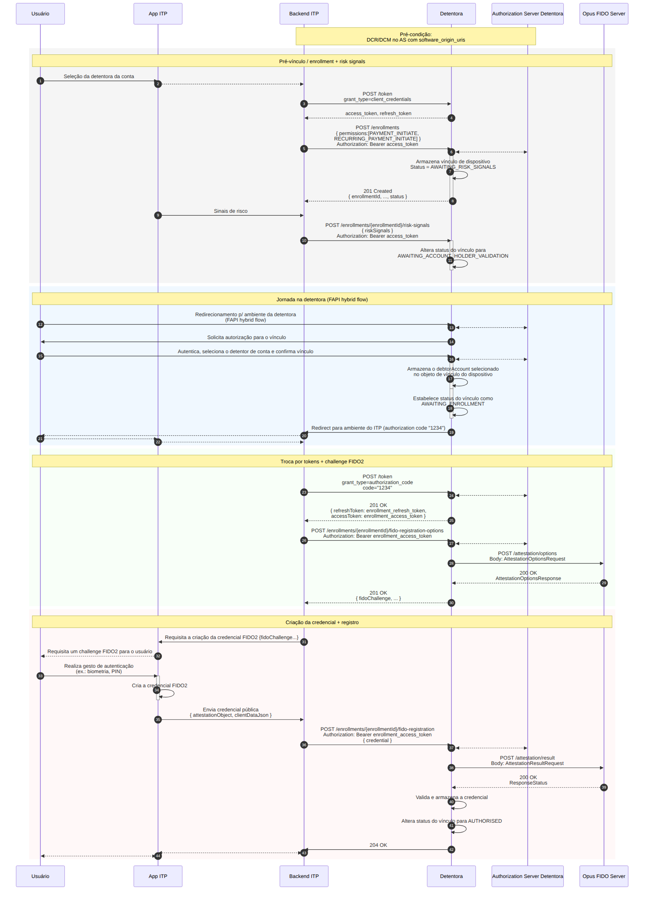

## Objetivo

A **Vinculação de Dispositivo/Conta** (*enrollment*) estabelece o vínculo entre o dispositivo do usuário e a sua conta na Detentora, seguindo as especificações do *Open Finance Brasil* — **Jornada sem Redirecionamento (JSR)**. Ao final do fluxo, uma **credencial FIDO2** fica registrada no dispositivo e apta a autorizar pagamentos futuros por biometria, sem novos redirecionamentos à Detentora.

Nesta jornada, o Opus FIDO Server executa a cerimônia de ***attestation*** (registro da credencial WebAuthn): gera as opções de criação da credencial (`/attestation/options`) e valida o resultado devolvido pelo dispositivo (`/attestation/result`).

## Pré-condições

- **DCR/DCM** realizado no *Authorization Server* com `software_origin_uris` (ver [DCR/DCM](dcrDcm.html));
- ITP com capacidades FIDO2.

## Diagrama de Sequência

## Etapas do Fluxo

### 1. Pré-vínculo — *enrollment* + sinais de risco

1. O usuário seleciona a Detentora da conta no App do ITP.
2. O *Backend* do ITP obtém um *token* via `POST /token` (`grant_type=client_credentials`).
3. O *Backend* cria o vínculo via `POST /enrollments` (com `permissions`, ex.: `PAYMENT_INITIATE`, `RECURRING_PAYMENT_INITIATE`). A Detentora armazena o vínculo com status **`AWAITING_RISK_SIGNALS`** e retorna `201 Created` com o `enrollmentId`.
4. O *Backend* envia os sinais de risco via `POST /enrollments/{enrollmentId}/risk-signals`. A Detentora altera o status para **`AWAITING_ACCOUNT_HOLDER_VALIDATION`**.

### 2. Jornada na Detentora (FAPI *hybrid flow*)

5. O usuário é redirecionado ao ambiente da Detentora e autentica, seleciona o detentor de conta e confirma o vínculo.
6. A Detentora armazena o `debtorAccount` selecionado no objeto de vínculo, estabelece o status como **`AWAITING_ENROLLMENT`** e redireciona de volta ao ambiente do ITP com o *authorization code*.

### 3. Troca por *tokens* + *challenge* FIDO2 (*attestation*)

7. O *Backend* troca o *code* por *tokens* via `POST /token` (`grant_type=authorization_code`), recebendo `enrollment_access_token` e `enrollment_refresh_token`.
8. O *Backend* solicita as opções de registro via `POST /enrollments/{enrollmentId}/fido-registration-options`.
9. A Detentora aciona o FIDO Server via **`POST /attestation/options`** e devolve ao *Backend* o `fidoChallenge` (compatível com [W3C WebAuthn-2][webauthn-makecred]).

### 4. Criação da credencial + registro (*attestation result*)

10. O App requisita ao usuário o gesto de autenticação (biometria/PIN) e **cria a credencial FIDO2** no dispositivo.
11. O App envia a credencial pública (`attestationObject`, `clientDataJson`) ao *Backend*, que a repassa via `POST /enrollments/{enrollmentId}/fido-registration`.
12. A Detentora aciona o FIDO Server via **`POST /attestation/result`**. Com sucesso, valida e armazena a credencial e altera o status do vínculo para **`AUTHORISED`**.

## Endpoints do FIDO Server

| Método | Endpoint | Descrição | Sucesso |
| :----: | :------- | :-------- | :-----: |
| POST | `/attestation/options` | Obtém as opções de registro (criação) da credencial FIDO2 | 200 |
| POST | `/attestation/result` | Submete o resultado do registro para validação e armazenamento | 200 |

### `AttestationOptionsRequest`

| Campo | Descrição |
| :--- | :--- |
| `username` | Identificador do usuário na cerimônia. Recomenda-se utilizar o `enrollmentId` |
| `displayName` | Nome amigável exibido ao usuário, a critério da Detentora |
| `authenticatorSelection` | Critérios de seleção do autenticador (`authenticatorAttachment`, `userVerification`, `residentKey`, `requireResidentKey`) |
| `attestation` | Preferência de *attestation conveyance* |
| `extensions` | Extensões WebAuthn |

### `AttestationResultRequest`

| Campo | Descrição |
| :--- | :--- |
| `id` / `rawId` | Identificadores da credencial criada |
| `response` | `clientDataJSON` + `attestationObject` gerados pelo dispositivo |
| `type` | Tipo da credencial (`public-key`) |
| `authenticatorAttachment` | Forma de acoplamento do autenticador (`platform`/`cross-platform`) |
| `getClientExtensionResults` | Resultados das extensões do cliente |

## Máquina de estados do vínculo

| Status | Como se chega | Próximo passo |
| :----- | :------------ | :------------ |
| `AWAITING_RISK_SIGNALS` | `POST /enrollments` retorna 201 | Enviar `/risk-signals` |
| `AWAITING_ACCOUNT_HOLDER_VALIDATION` | Após `/risk-signals` ser aceito | Redirect do usuário para a Detentora |
| `AWAITING_ENROLLMENT` | Usuário aprova na Detentora (OIDC OK) | Registrar a credencial FIDO2 |
| `AUTHORISED` | Credencial FIDO2 registrada com sucesso | Vínculo apto para autorizar pagamentos |

> **Importante:** A validação de `riskSignals` é responsabilidade exclusiva da Detentora — o Opus FIDO Server é agnóstico quanto ao conteúdo dos sinais de risco.

## Referências

- Especificação OpenAPI: [`opusFidoServer-oas.yaml`](anexos/yml/opusFidoServer-oas.yaml) (ver também [API associada][API-FidoServer])
- [SV Vínculo de Dispositivo — Open Finance Brasil](https://openfinancebrasil.atlassian.net/wiki/spaces/OF/pages/1436516353/v2.2.0+-+SV+V+nculo+de+dispositivo)
- [W3C WebAuthn-2 — makeCredentialOptions][webauthn-makecred]

[API-FidoServer]: ../../../../swagger-ui/index.html?api=oas-fido-server
[webauthn-makecred]: https://www.w3.org/TR/webauthn-2/#dictionary-makecredentialoptions
