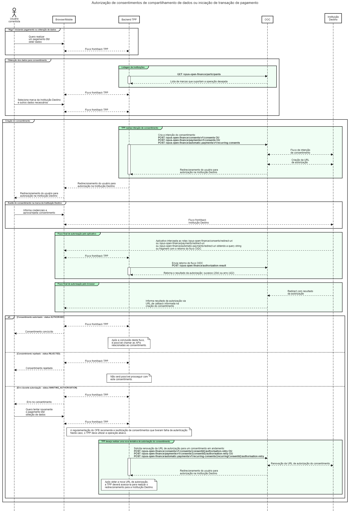
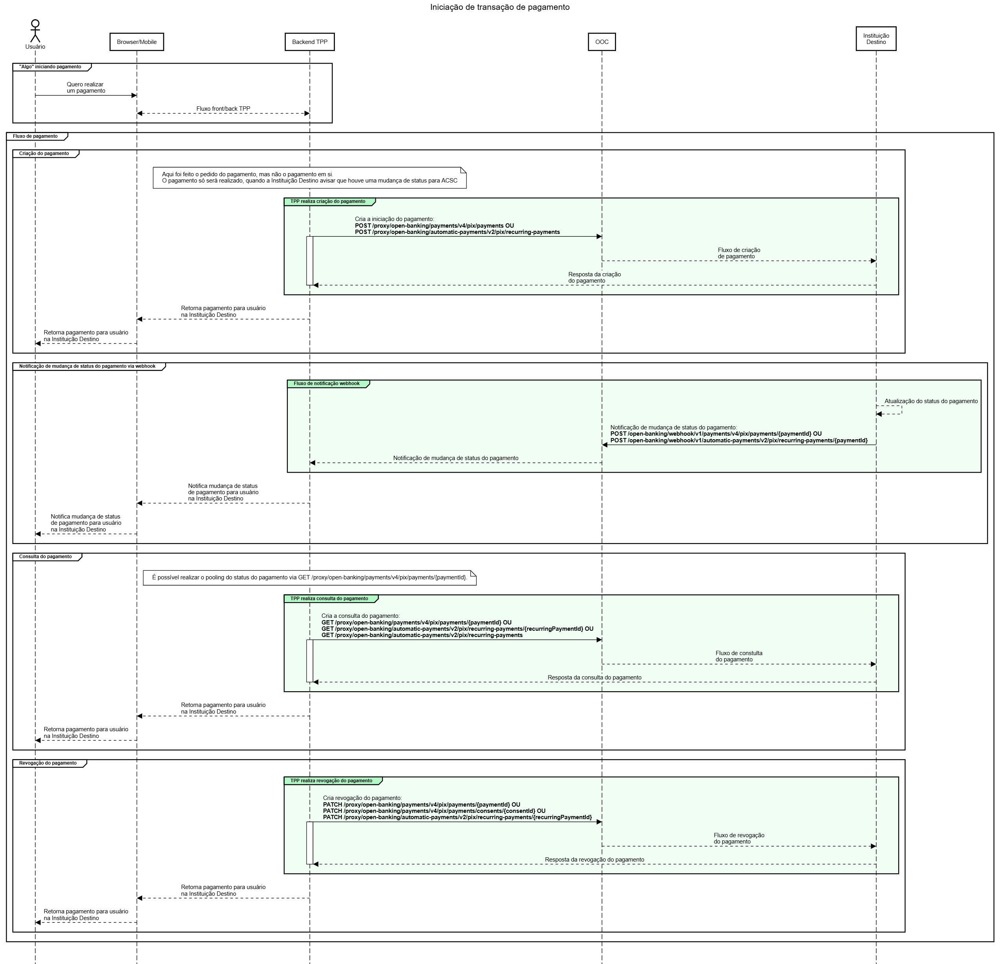
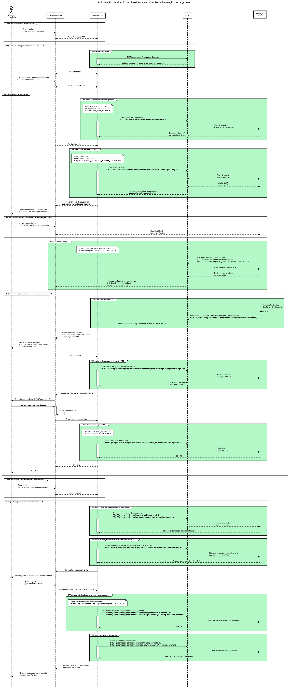

## Funcionamento do OpusTPP

Este documento descreve os fluxos de negócio suportados pelo OpusTPP para integração com o ecossistema Open Finance.

---

## Fluxo de Solicitação de Consentimento

O consentimento é a autorização concedida pelo usuário para que uma instituição Iniciadora de Pagamento (TPP) possa acessar seus dados ou realizar pagamentos em seu nome. O fluxo de solicitação é similar para ambas as finalidades (recepção de dados e iniciação de pagamento), diferenciando-se apenas em uma chamada específica.

### Diagrama de Sequência - Open Finance



### Etapas do Fluxo

#### 1. Listagem das Instituições Participantes

**Endpoint:** `GET /opus-open-finance/participants`

**Objetivo:** Identificar as instituições disponíveis para o consentimento.

Esta chamada retorna a lista de *marcas* de instituições cadastradas no Diretório de Participantes do Open Finance Brasil que suportam as operações desejadas.

As instituições são classificadas por suas funções:

| Tipo | Descrição | Finalidade |
| ---- | --------- | ---------- |
| **[Transmissora de Dados](../../openFinanceBrasil/perfisParticipacao/transmissorDeDados.html)** | Instituição que compartilha informações | Permite acesso a dados cadastrais e transacionais |
| **[Detentora de Conta](../../openFinanceBrasil/perfisParticipacao/detentorDeContas.html)** | Instituição que custodia a conta do usuário | Permite operações de iniciação de pagamento |

> **Importante:** O `AuthorisationServerId` da marca selecionada deve ser utilizado no header `x-authorisation-server-id` de todas as chamadas subsequentes.

**Filtros disponíveis:**

- **role (papel regulador):** DADOS, PAGTO, CONTA, CCORR;
- **familyType (família de APIs):** Define quais recursos a instituição oferece (ex.: "customers-business").

#### 2. Criação da Intenção de Consentimento

**Objetivo:** Registrar a intenção do TPP de acessar dados ou realizar pagamentos em nome do usuário.

**Endpoints por tipo de operação:**

| Finalidade | Endpoint |
| :--------: | :------: |
| Compartilhamento de Dados (Open Finance) | `POST /opus-open-finance/consents/v1/consents` |
| Iniciação de Pagamento | `POST /opus-open-finance/payments/v1/consents` |
| Iniciação de Pagamento Automático | `POST /opus-open-finance/automatic-payments/v1/recurring-consents` |

**Comportamento:**

- A chamada envia à Instituição Destino as informações do consentimento desejado;
- Resposta `HTTP 201 Created` indica criação bem-sucedida;
- O payload retorna o `consentId`, identificador único do consentimento;
- Status inicial: **AWAITING_AUTHORISATION** (aguardando autorização do usuário).

#### 3. Redirecionamento para Autorização

Após a criação do consentimento, o usuário deve ser redirecionado para o ambiente da Instituição Destino, onde:

- Visualiza as informações do consentimento solicitado;
- Aprova ou rejeita a solicitação;
- É redirecionado de volta à aplicação TPP ao final do processo.

**Considerações para aplicações mobile:**

- O aplicativo deve interceptar as URLs de redirecionamento;
- Após o redirecionamento, deve acionar o endpoint `authorization-result` com o resultado do fluxo OIDC;
- **É obrigatória** a implementação da rota de redirect web como contingência, garantindo que o usuário conheça o resultado mesmo quando a URL é aberta em outro aplicativo.

#### 3.1. Nova Tentativa de Autorização

Em casos de falha no redirecionamento (ex.: timeout, erro 500 do servidor), o BACEN recomenda a **reutilização da mesma intenção de consentimento**.

**Endpoints para nova tentativa:**

| Finalidade | Endpoint |
| :--------: | :------: |
| Compartilhamento de Dados | `POST /opus-open-finance/consents/v1/consents/{consentId}/authorisation-retry` |
| Iniciação de Pagamento | `POST /opus-open-finance/payments/v1/consents/{consentId}/authorisation-retry` |

> **Prazo para nova tentativa:** Disponível enquanto o status for **AWAITING_AUTHORISATION** (5 minutos para pagamento, 60 minutos para compartilhamento de dados).

#### 4. Retorno do Resultado da Autorização

Após o redirecionamento, a aplicação TPP encaminha o resultado ao OpusTPP.

**Possíveis resultados:**

| Decisão do Usuário | Status do Consentimento | Ações do Sistema |
| :----------------: | :---------------------: | :--------------: |
| Aprova | **AUTHORISED** | Tokens de acesso são gerados e armazenados automaticamente |
| Rejeição | **REJECTED** | Fluxo encerrado |
| Aguardando | **AWAITING_AUTHORISATION** | Permite nova tentativa |

Os tokens gerados são gerenciados pelo OpusTPP e utilizados de forma transparente nas etapas de utilização do consentimento.

---

## Utilização do Consentimento

Após a aprovação, o consentimento pode ser utilizado para:

| Tipo de Consentimento | Finalidade |
| :-------------------: | :--------: |
| Compartilhamento de Dados | Obtenção de dados cadastrais e transacionais |
| Iniciação de Pagamento | Criação e execução de pagamentos |
| Pagamento Automático | Criação e gestão de pagamentos recorrentes |

**Documentação específica:**

- [Recepção de Dados Cadastrais e Transacionais](../../openFinanceBrasil/perfisParticipacao/receptorDeDados.html)
- [Iniciação de Transação de Pagamento](../../openFinanceBrasil/perfisParticipacao/itp/index.html)
- [Iniciação de Transação de Pagamento Automático](../../openFinanceBrasil/perfisParticipacao/itp/itpAutomatico.html)

> **Atenção:** Consentimentos de dados e de pagamento são independentes. Um consentimento de leitura de dados **não pode** ser utilizado para criar pagamentos, e vice-versa.

---

## Paginação em APIs de Proxy

Algumas APIs de proxy retornam links de paginação definidos pela instituição:

```json
{
  "data": {},
  "links": {
    "self": "https://mtls-api.banco.com.br/open-banking/api/v2/resource?page=2&page-size=25",
    "first": "https://mtls-api.banco.com.br/open-banking/api/v2/resource?page=2&page-size=25",
    "prev": "https://mtls-api.banco.com.br/open-banking/api/v2/resource?page=1&page-size=25",
    "next": "https://mtls-api.banco.com.br/open-banking/api/v2/resource?page=3&page-size=25",
    "last": "https://mtls-api.banco.com.br/open-banking/api/v2/resource?page=5&page-size=25"
  }
}
```

Para acessar os recursos, substitua o FQDN (domínio) da instituição pelo do **OpusTPP**, mantendo os parâmetros após o caractere `?`.

**Exemplo:** Para acessar a próxima página: `https://opustpp.instituicao.com.br/proxy/open-banking/resources/v2/resources?page=3&page-size=25`

---

## Fluxo de Solicitação de Iniciação de Pagamento

A iniciação do pagamento deve ocorrer **após** a autorização do consentimento de pagamento. Este fluxo utiliza as APIs de proxy para efetivar a transação.



Para detalhes técnicos, consulte a documentação específica de [Iniciação de Transação de Pagamento](../../openFinanceBrasil/perfisParticipacao/itp/index.html) e [Pagamento Automático](../../openFinanceBrasil/perfisParticipacao/itp/itpAutomatico.html).

---

## Fluxo de Solicitação de Vínculo de Dispositivo

O vínculo de dispositivo permite que o usuário autorize um dispositivo (ex.: celular, computador) para aprovar transações utilizando autenticação FIDO2 (biometria, PIN), proporcionando maior segurança e praticidade.



### Etapas do Fluxo de Solicitação de Vínculo de Dispositivo

#### 1. Listagem das Instituições Participantes do Fluxo de Solicitação de Vínculo de Dispositivo

Mesmo processo descrito no Fluxo de Solicitação de Consentimento descrito mais acima.

#### 2. Criação do Vínculo de Dispositivo

**Endpoint:** `POST /opus-open-finance/enrollments/v1/enrollments`

Esta chamada registra a intenção de criar um vínculo de dispositivo. O vínculo pode ser configurado para aprovar:

- Consentimentos de pagamento;
- Transferências inteligentes.

> **Importante:** Para suportar ambos os tipos, é necessário criar dois vínculos distintos, cada um com suas permissões específicas.

**Status inicial:** **AWAITING_RISK_SIGNALS**

**Seleção de Versão Regulatória:**

- Se enviado o header `x-regulatory-v`, o sistema tenta usar a versão solicitada;
- Se não enviado, utiliza a versão mais atual disponível;
- O header `x-selected-regulatory-v` na resposta indica a versão efetivamente utilizada.

#### 3. Envio dos Sinais de Risco

**Endpoint:** `POST /opus-open-finance/enrollments/v1/enrollments/{enrollmentId}/risk-signals`

Envia à Instituição Destino os sinais de risco coletados (ex.: dados do dispositivo, localização). A resposta contém a URL para redirecionamento do usuário.

**Status após esta etapa:** **AWAITING_ACCOUNT_HOLDER_VALIDATION**

#### 4. Redirecionamento para Autorização

O usuário é redirecionado para a Instituição Destino, onde poderá:

- Definir limites para transações;
- Configurar data de expiração do vínculo;
- Nomear o dispositivo;
- Confirmar ou rejeitar o vínculo.

#### 5. Retorno do Resultado da Autorização

Após a confirmação (ou rejeição), o resultado é processado pelo OpusTPP, que:

- Gerencia o retorno do fluxo OIDC;
- Realiza o callback para geração de tokens;
- Redireciona o usuário de volta à aplicação TPP.

**Possíveis resultados:**

| Decisão | Status do Vínculo |
| :-----: | :---------------: |
| Confirmação | **AWAITING_ENROLLMENT** |
| Rejeição | **REJECTED** |

#### 6. Envio das Opções de Registro FIDO

**Endpoint:** `POST /proxy/open-banking/enrollments/v2/enrollments/{enrollmentId}/fido-registration-options`

Solicita à Instituição Destino as informações necessárias para iniciar o registro da credencial FIDO2.

#### 7. Envio do Registro FIDO

**Endpoint:** `POST /proxy/open-banking/enrollments/v2/enrollments/{enrollmentId}/fido-registration`

Após o usuário realizar o gesto de autenticação (ex.: biometria, PIN) e a credencial FIDO2 ser criada no dispositivo, os dados são enviados para a Instituição Destino.

**Status final:** **AUTHORISED**

#### 8. Criação da Intenção de Pagamento

Com o vínculo aprovado, o TPP pode criar uma intenção de pagamento:

| Fluxo | Endpoint |
| :---: | :------: |
| Pagamento padrão | `POST /opus-open-finance/payments/v1/consents` |
| Transferências Inteligentes | `POST /opus-open-finance/automatic-payments/v1/recurring-consents` |

#### 9. Obtenção dos Parâmetros para Autenticação FIDO

**Endpoint:** `POST /opus-open-finance/enrollments/v1/enrollments/{enrollmentId}/fido-sign-options`

Solicita os parâmetros para que o usuário realize a autenticação FIDO2. O corpo da requisição deve conter o ID do consentimento criado:

- Para pagamento padrão: `consentId`;
- Para transferências inteligentes: `recurringConsentId`.

#### 10. Autorização do Consentimento de Pagamento

**Endpoints conforme tipo:**

- `POST /proxy/open-banking/enrollments/v2/consents/{consentId}/authorise`
- `POST /proxy/open-banking/enrollments/v2/recurring-consents/{recurringConsentId}/authorise`

Envia os sinais de risco e os dados da asserção FIDO2 para a Instituição Destino.

**Status após autorização:** **AUTHORISED**

Com o consentimento autorizado, a iniciação do pagamento segue o padrão dos demais fluxos.

---

## Fluxo Jornada Otimizada

### Conceito

A Jornada Otimizada simplifica a experiência do usuário ao permitir o compartilhamento de dados da conta no mesmo fluxo de um pagamento. Isso reduz problemas como pagamentos sem saldo disponível, pois o TPP pode consultar o saldo antes de solicitar o pagamento.

### Como Funciona

No fluxo de Jornada Otimizada, são gerados **dois consentimentos**:

| Tipo | Descrição |
| :--: | :-------: |
| **Primário (Pagamento)** | Consentimento principal que autoriza o pagamento |
| **Secundário (Dados)** | Consentimento vinculado que autoriza acesso a dados da conta |

### Relação entre os Consentimentos

- O consentimento secundário pode ser revogado sem afetar o consentimento primário;
- Se o consentimento primário for revogado, o secundário também é revogado automaticamente;
- Se apenas o consentimento de dados for cancelado, o usuário precisará conceder um novo para que o acesso ao saldo seja restabelecido.

### Passo a Passo

#### 1. Criar Consentimento Secundário (Dados)

**Endpoint:** `POST /opus-open-finance/consents/v1/consents`

Informar no corpo da requisição:

```json
"isLinked": true
```

As permissões obrigatórias:

```json
"permissions": [
  "ACCOUNTS_READ",
  "ACCOUNTS_BALANCES_READ",
  "ACCOUNTS_OVERDRAFT_LIMITS_READ",
  "RESOURCES_READ"
]
```

#### 2. Criar Consentimento Primário (Pagamento ou Vínculo)

**Endpoints:**

- `POST /opus-open-finance/payments/v1/consents` (pagamento)
- `POST /opus-open-finance/automatic-payments/v1/recurring-consents` (pagamento automático)
- `POST /opus-open-finance/enrollments/v1/enrollments` (vínculo de dispositivo)

Informar no corpo da requisição:

```json
"journey": {
  "isLinked": true,
  "linkId": "consentId"
}
```

Onde `linkId` é o ID do consentimento secundário criado no passo anterior.

#### 3. Fluxo de Autorização

Quando o usuário aprova o consentimento primário:

- O consentimento secundário é automaticamente aprovado;
- O TPP pode acessar os dados da conta usando o ID do consentimento secundário;
- O fluxo de pagamento segue normalmente.
